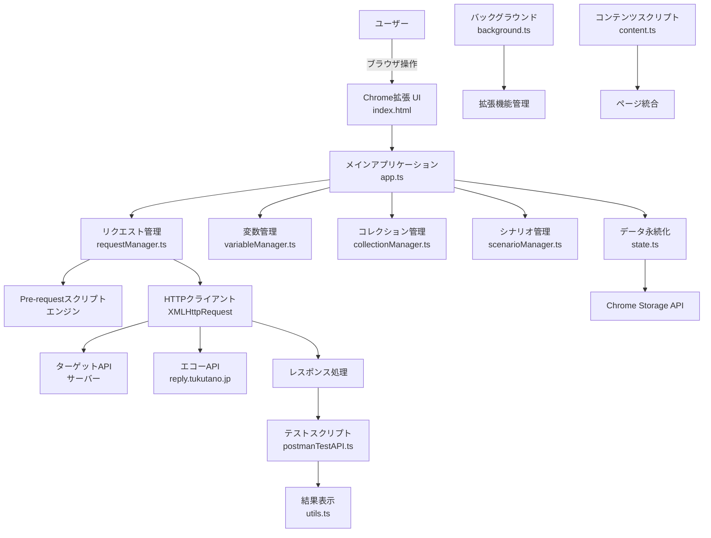

# システム企画書：PostPro API Tester Chrome 拡張

## 1. はじめに

### 1.1 ドキュメントの目的

本企画書は、API 開発・テストを効率化する Chrome 拡張機能「PostPro API Tester」の全体像を整理し、現在の実装状況および今後の発展計画を示すことを目的とします。

### 1.2 想定読者

* プロジェクトマネージャー
* フロントエンドエンジニア
* QA／テストエンジニア
* API開発者
* Chrome拡張機能開発者

---

## 2. 背景と課題

### 2.1 現状の課題

* **複数ツールの煩雑さ**
  現在、Postman、Talend API Tester、curl 等、複数ツールを併用しており、ツール切り替えによる作業効率低下が発生。

* **環境依存の問題**
  デスクトップアプリ版のみの提供が多く、ブラウザ内で完結できる選択肢が限定的。

* **チーム共有の複雑さ**
  設定ファイルのバージョン管理や共有に工数がかかり、チーム間での統一が困難。

* **テスト自動化の困難**
  API テストの自動化に専門知識が必要で、開発者の学習コストが高い。

### 2.2 解決のアプローチ

ブラウザネイティブなAPI テストプラットフォームを提供し、開発からテスト、共有まで一貫したワークフローを実現する。

---

## 3. 目的とゴール

### 3.1 プロジェクトの目的

ブラウザ内だけで完結する包括的な API テストプラットフォームを提供し、開発～テスト～共有の一連作業をシームレスにする。

### 3.2 達成目標

* **現在の状況（達成済み）**
  - 主要機能の実装完了（v3.0.0）
  - Postman互換テストAPI実装
  - 包括的な単体テスト実装（Jest）
  - 統合テスト環境構築（Puppeteer）

* **短期目標（今後3ヶ月）**
  - Chrome Web Store公開準備
  - ユーザビリティテスト実施
  - パフォーマンス最適化

* **中期目標（今後6ヶ月）**
  - プラグイン機構の実装
  - CI/CDパイプライン連携機能
  - 多言語対応（英語・日本語）

---

## 4. 想定ユーザー

### 4.1 プライマリーユーザー

1. **フロントエンド開発者**
   - API統合テスト
   - モックデータ検証

2. **バックエンド開発者**
   - API開発・デバッグ
   - エンドポイント検証

3. **QA/テストエンジニア**
   - 自動テストシナリオ作成
   - 回帰テスト実行

### 4.2 セカンダリーユーザー

4. **DevOpsエンジニア**
   - CI/CDパイプライン統合
   - 監視・アラート設定

5. **プロダクトマネージャー**
   - API仕様確認
   - 進捗管理

---

## 5. システム概要

「PostPro API Tester」は、Chrome 拡張として動作し、以下の特徴を持ちます：

* **ブラウザネイティブ**: インストール不要、どこでも利用可能
* **Postman互換**: 既存ワークフローの移行が容易
* **エコーAPI連携**: 専用テストAPI（https://reply.tukutano.jp）による検証機能
* **包括的テスト**: 単体テストから統合テストまで完備
* **モジュラー設計**: 各機能が独立し、保守性が高い

---

## 6. 機能要件

### 6.1 コア機能（実装済み）

#### リクエスト送信機能
* **HTTP メソッド**: GET, POST, PUT, DELETE, PATCH, HEAD, OPTIONS
* **認証サポート**: Basic Auth, Bearer Token, API Key, OAuth2
* **ボディタイプ**: JSON, Form Data, Raw Text, Binary Files
* **ヘッダー・パラメータ**: 動的追加・編集
* **Cookie 管理**: 自動取得・送信

#### 高度なスクリプト機能
* **Pre-request スクリプト**: リクエスト前の動的処理（JavaScript実行）
* **テストスクリプト**: 
  - Postman互換API（pm.test, pm.expect等）
  - 従来形式コマンド（status, headerEquals等）
* **変数システム**: グローバル／環境／コレクション変数
* **実行結果参照**: 前回レスポンスの値を次回リクエストへ引き継ぎ

#### データ管理機能
* **コレクション管理**: 関連リクエストのグループ化
* **シナリオ実行**: 複数リクエストを順次実行するワークフロー
* **履歴管理**: リクエスト履歴の自動保存・検索
* **インポート・エクスポート**: データの共有・バックアップ

#### テスト・検証機能
* **レスポンス検証**: ステータス、ヘッダー、ボディの自動検証
* **JSONPath サポート**: 複雑なJSON構造からのデータ抽出
* **エコーAPIテスト**: 送信内容の確認・検証

### 6.2 拡張機能（計画中）

* **プラグインシステム**: 第三者による機能拡張
* **リアルタイム共有**: チーム間でのコレクション同期
* **CI/CD統合**: Jenkins/GitHub Actions連携

---

## 7. 非機能要件

### 7.1 パフォーマンス要件

* **起動時間**: 200ms以下
* **レスポンス時間**: リクエスト実行は1秒以内
* **メモリ使用量**: 50MB以下

### 7.2 セキュリティ要件

* **スクリプト実行**: サンドボックス環境での安全な実行
* **データ保護**: ローカルストレージでの暗号化
* **権限管理**: 最小権限の原則

### 7.3 拡張性要件

* **モジュラー設計**: 機能の独立性
* **プラグイン対応**: API による機能拡張
* **多言語対応**: 国際化フレームワーク

### 7.4 信頼性要件

* **テストカバレッジ**: 80%以上
* **エラーハンドリング**: 包括的なエラー処理
* **データ整合性**: バックアップ・復旧機能

---

## 8. システム構成

### 8.1 アーキテクチャ概要



### 8.2 主要コンポーネント

| コンポーネント | ファイル | 役割 |
|-------------|----------|------|
| UI管理 | app.ts, utils.ts | ユーザーインターフェース、DOM操作 |
| リクエスト処理 | requestManager.ts | HTTP リクエスト送信・レスポンス処理 |
| テスト実行 | postmanTestAPI.ts | Postman互換テストAPI実装 |
| 変数管理 | variableManager.ts | 変数の解決・置換 |
| データ管理 | collectionManager.ts, scenarioManager.ts | コレクション・シナリオ管理 |
| 状態管理 | state.ts | グローバル状態・ローカルストレージ |
| 拡張機能基盤 | background.ts, content.ts | Chrome拡張機能フレームワーク |

---

## 9. 技術スタック

### 9.1 開発技術

* **言語・フレームワーク**
  - TypeScript 5.8.3: 型安全な開発
  - Vite 5.0.0: 高速ビルドシステム
  - Chrome Extensions API v3: マニフェストv3対応

* **ライブラリ**
  - JSONPath Plus 8.0.0: JSONパス処理
  - Jest 29.5.0: 単体テスト
  - Puppeteer 21.0.0: 統合テスト

### 9.2 ビルド・デプロイ

* **ビルドツール**: Vite + Rollup
* **型チェック**: TypeScript Compiler
* **テスト**: Jest + ts-jest
* **パッケージング**: Chrome Extension Package

### 9.3 品質管理

* **テスト戦略**
  - 単体テスト: Jest（utils, state, variableManager等）
  - 統合テスト: Puppeteer（extension-simplified.test.ts）
  - ビルドテスト: 拡張機能の動作確認

* **コード品質**
  - TypeScript厳密モード
  - ESLint（設定予定）
  - コードカバレッジ測定

---

## 10. 現在の実装状況

### 10.1 完了済み機能

#### コア機能
- ✅ HTTP リクエスト送信（全メソッド対応）
- ✅ 認証システム（Basic, Bearer, API Key, OAuth2）
- ✅ Pre-requestスクリプト実行
- ✅ Postman互換テストAPI
- ✅ 変数システム（3階層）
- ✅ コレクション・シナリオ管理
- ✅ リクエスト履歴
- ✅ インポート・エクスポート
- ✅ エコーAPIテスト

#### 開発基盤
- ✅ TypeScript設定
- ✅ Viteビルドシステム
- ✅ Jest単体テスト（5ファイル）
- ✅ Puppeteer統合テスト
- ✅ Chrome拡張機能パッケージング

#### UI/UX
- ✅ レスポンシブデザイン
- ✅ タブベースUI
- ✅ エラーハンドリング
- ✅ ローディング表示

### 10.2 現在のファイル構成

```
src/
├── app.ts                 # メインアプリケーションロジック
├── background.ts          # Chrome拡張バックグラウンドスクリプト
├── collectionManager.ts   # コレクション・フォルダ管理
├── content.ts             # コンテンツスクリプト
├── defaultData.ts         # サンプルデータとデフォルト設定
├── historyManager.ts      # リクエスト履歴管理
├── importExport.ts        # データのインポート・エクスポート
├── index.ts               # エントリーポイント
├── init.ts                # 初期化処理
├── injected.ts            # ページ注入スクリプト
├── interceptorManager.ts  # HTTPリクエストインターセプト
├── postmanTestAPI.ts      # Postman形式テストAPI実装（NEW!）
├── requestManager.ts      # リクエスト送信・レスポンス処理・テスト実行
├── scenarioManager.ts     # シナリオ管理
├── settings.ts            # 設定管理
├── state.ts               # グローバル状態管理・ローカルストレージ
├── types.ts               # TypeScript型定義
├── utils.ts               # ユーティリティ関数・UI操作
└── variableManager.ts     # 変数管理・置換処理
```

---

## 11. UI/UX フロー

### 11.1 基本ワークフロー

1. **拡張機能起動**
   - 拡張アイコンをクリック → メイン画面表示
   - 初回起動時：サンプルデータ読み込み

2. **リクエスト作成・実行**
   - 新規リクエスト作成
   - メソッド・URL・認証設定
   - ヘッダー・パラメータ・ボディ編集
   - Pre-requestスクリプト設定
   - 「Send」ボタンでリクエスト実行

3. **レスポンス確認・テスト**
   - レスポンス受信 → 構造化表示
   - テストスクリプト自動実行
   - テスト結果のアサーション表示

4. **データ管理**
   - リクエスト保存・コレクション追加
   - シナリオへの組み込み
   - 履歴からの再実行

### 11.2 高度なワークフロー

1. **シナリオ実行**
   - 複数リクエストの順次実行
   - 中間結果の変数への保存
   - エラー時の停止・継続選択

2. **チーム共有**
   - コレクションのエクスポート
   - 設定の共有・インポート
   - 環境変数の管理

---

## 12. 開発・テスト戦略

### 12.1 テスト体系

#### 単体テスト（Jest）
```bash
tests/unit/
├── postmanAPI.test.ts      # Postman API互換性テスト
├── requestManager.test.ts  # HTTP リクエスト処理テスト
├── state.test.ts          # 状態管理・ストレージテスト
├── utils.test.ts          # ユーティリティ関数テスト
└── variableManager.test.ts # 変数解決・置換テスト
```

#### 統合テスト（Puppeteer）
```bash
tests/
├── extension-simplified.test.ts  # 基本機能統合テスト
└── build.test.ts                # ビルド確認テスト
```

### 12.2 品質保証

* **継続的テスト**: 
  - 単体テスト：`npm run test`
  - 統合テスト：Puppeteerによる自動テスト
  - ビルドテスト：拡張機能の動作確認

* **コードカバレッジ**: Jestによるカバレッジ測定
* **型安全性**: TypeScript厳密モードによる静的解析

---

## 13. リスクと対策

### 13.1 技術的リスク

| リスク | 影響度 | 対策 |
|--------|--------|------|
| Chrome API制限・変更 | 高 | 定期的なマニフェストアップデート、フォールバック実装 |
| スクリプト実行によるセキュリティ脆弱性 | 高 | サンドボックス強化、CSP制約、入力検証 |
| パフォーマンス劣化 | 中 | プロファイリング、遅延読み込み、キャッシュ最適化 |
| ブラウザ互換性 | 中 | Chrome以外のブラウザサポート検討 |

### 13.2 事業的リスク

| リスク | 影響度 | 対策 |
|--------|--------|------|
| 競合ツールとの差別化不足 | 中 | プラグイン機構、独自機能開発 |
| ユーザー獲得の困難 | 中 | Chrome Web Store最適化、コミュニティ構築 |
| 開発リソース不足 | 低 | モジュラー設計による保守性向上 |

### 13.3 運用リスク

| リスク | 影響度 | 対策 |
|--------|--------|------|
| エコーAPIの可用性 | 中 | フォールバックURL、ローカルエコー機能 |
| データ損失 | 低 | 定期バックアップ、エクスポート機能 |
| サポート対応 | 低 | ドキュメント充実、FAQ整備 |

---

## 14. 今後の展望

### 14.1 短期計画（3ヶ月）

#### Chrome Web Store公開
- ストア用アセット準備
- プライバシーポリシー作成
- アプリケーション審査対応

#### ユーザビリティ改善
- ユーザーテスト実施
- UI/UX最適化
- パフォーマンス向上

### 14.2 中期計画（6ヶ月）

#### 機能拡張
- **プラグインシステム**: 第三者による機能拡張
- **CI/CD連携**: Jenkins/GitHub Actions連携
- **多言語対応**: i18n実装

#### エコシステム拡張
- **API拡張**: RESTful API提供
- **クラウド同期**: チーム共有機能
- **企業向け機能**: 組織管理、権限制御

### 14.3 長期計画（1年）

#### プラットフォーム拡張
- **モバイル対応**: PWA化によるタブレット・スマートフォンサポート
- **デスクトップアプリ**: Electron版の提供
- **VSCode拡張**: 開発環境統合

#### AI/ML統合
- **スマートテスト**: AI による自動テストケース生成
- **異常検知**: レスポンスパターン分析
- **最適化提案**: パフォーマンス改善提案

---

## 15. 成功指標

### 15.1 技術指標

* **コードカバレッジ**: 80%以上維持
* **ビルド時間**: 30秒以下
* **拡張機能サイズ**: 5MB以下
* **メモリ使用量**: 50MB以下

### 15.2 品質指標

* **バグ発生率**: 月1件以下
* **テスト実行時間**: 5分以下
* **ドキュメント更新**: 週1回以上

### 15.3 ユーザー指標（公開後）

* **インストール数**: 1000+（3ヶ月）
* **アクティブユーザー**: 500+（6ヶ月）
* **ユーザー評価**: 4.0以上
* **リテンション率**: 60%以上

---

## 16. まとめ

「PostPro API Tester」は、既に強固な技術基盤と包括的な機能を持つ成熟したプロダクトです。現在の実装状況を基盤として、Chrome Web Storeでの公開、ユーザーコミュニティの構築、そして次世代のAPI開発ツールへの発展を目指します。

### 16.1 プロジェクトの強み

* **完成度の高い実装**: 主要機能がすべて実装済み
* **Postman互換性**: 既存ワークフローの移行が容易
* **包括的テスト**: 単体テストから統合テストまで完備
* **モジュラー設計**: 保守性と拡張性を両立
* **エコーAPI統合**: 独自のテスト検証機能

### 16.2 次のアクション

1. **Chrome Web Store公開準備**
2. **ユーザビリティテスト実施**
3. **コミュニティ構築**
4. **プラグインシステム設計**
5. **国際化対応**

---

**PostPro API Tester** は、API開発の未来を形作る革新的なツールとして、継続的な成長を続けていきます。