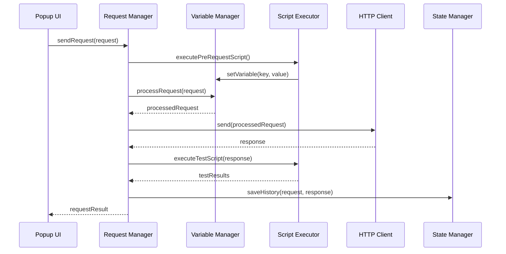
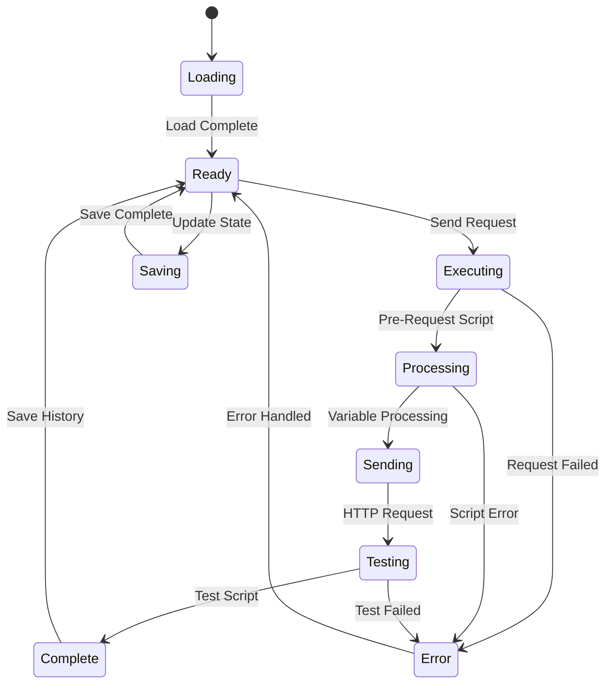

# 基本設計文書：PostPro API Tester Chrome 拡張

## 1. 文書概要

### 1.1 文書の目的
本基本設計文書は、要件定義文書に基づいて、PostPro API Tester Chrome拡張機能のシステム全体の構造とコンポーネント間の関係を設計するものです。詳細設計とプログラミングの基礎となる技術的な設計指針を提供します。

### 1.2 文書の範囲
- システムアーキテクチャ設計
- コンポーネント設計とモジュール構成
- データフロー設計
- インターフェース設計
- 技術的制約と実装方針

### 1.3 参照文書
- システム企画書（docs/01.sp.md）
- 要求定義文書（docs/02.sa.md）
- 要件定義文書（docs/03.rd.md）
- プロジェクト構成ファイル（CLAUDE.md）

---

## 2. システムアーキテクチャ設計

### 2.1 全体アーキテクチャ

#### 階層アーキテクチャ
PostPro API TesterはChrome拡張機能として、以下の階層構造で設計されます：

```
┌─────────────────────────────────────────────┐
│            Presentation Layer               │
│  ┌─────────────────┐  ┌─────────────────┐  │
│  │   Popup UI      │  │  Content Script │  │
│  │  (index.html)   │  │  (content.ts)   │  │
│  │   (app.ts)      │  │                 │  │
│  └─────────────────┘  └─────────────────┘  │
└─────────────────────────────────────────────┘
┌─────────────────────────────────────────────┐
│             Application Layer               │
│  ┌─────────────────┐  ┌─────────────────┐  │
│  │ Request Manager │  │Collection Manager│ │
│  │ Variable Manager│  │Scenario Manager │  │
│  │ Test Executor   │  │ History Manager │  │
│  └─────────────────┘  └─────────────────┘  │
└─────────────────────────────────────────────┘
┌─────────────────────────────────────────────┐
│               Service Layer                 │
│  ┌─────────────────┐  ┌─────────────────┐  │
│  │ Service Worker  │  │ Injected Script │  │
│  │ (background.ts) │  │ (injected.ts)   │  │
│  └─────────────────┘  └─────────────────┘  │
└─────────────────────────────────────────────┘
┌─────────────────────────────────────────────┐
│                Data Layer                   │
│  ┌─────────────────┐  ┌─────────────────┐  │
│  │ State Manager   │  │ Storage Manager │  │
│  │   (state.ts)    │  │Chrome Storage API│ │
│  └─────────────────┘  └─────────────────┘  │
└─────────────────────────────────────────────┘
```

#### Chrome拡張機能アーキテクチャ
```
┌─────────────────────────────────────────────┐
│                Web Page                     │
│  ┌─────────────────┐                       │
│  │ Injected Script │ ←── HTTP Intercept     │
│  │  (injected.ts)  │                       │
│  └─────────────────┘                       │
└─────────────────────────────────────────────┘
            ↕ Message Passing
┌─────────────────────────────────────────────┐
│            Content Script                   │
│  ┌─────────────────┐                       │
│  │  content.ts     │ ←── DOM Interaction    │
│  └─────────────────┘                       │
└─────────────────────────────────────────────┘
            ↕ Message Passing
┌─────────────────────────────────────────────┐
│            Service Worker                   │
│  ┌─────────────────┐                       │
│  │ background.ts   │ ←── Background Tasks   │
│  └─────────────────┘                       │
└─────────────────────────────────────────────┘
            ↕ Message Passing
┌─────────────────────────────────────────────┐
│              Popup UI                       │
│  ┌─────────────────┐                       │
│  │   app.ts        │ ←── User Interface     │
│  │  index.html     │                       │
│  └─────────────────┘                       │
└─────────────────────────────────────────────┘
```

### 2.2 コンポーネント間通信設計

#### Message Passing API設計
```typescript
// メッセージ型定義
interface MessageBase {
  type: string;
  id?: string;
  timestamp: number;
}

interface RequestMessage extends MessageBase {
  type: 'SEND_REQUEST';
  data: {
    request: Request;
    options?: RequestOptions;
  };
}

interface ResponseMessage extends MessageBase {
  type: 'REQUEST_RESPONSE';
  data: {
    response: Response;
    error?: Error;
  };
}

interface StateUpdateMessage extends MessageBase {
  type: 'STATE_UPDATE';
  data: {
    path: string;
    value: any;
  };
}

// メッセージルーティング
class MessageRouter {
  private handlers: Map<string, MessageHandler[]> = new Map();
  
  register(type: string, handler: MessageHandler): void {
    if (!this.handlers.has(type)) {
      this.handlers.set(type, []);
    }
    this.handlers.get(type).push(handler);
  }
  
  async route(message: MessageBase): Promise<any> {
    const handlers = this.handlers.get(message.type) || [];
    const results = await Promise.all(
      handlers.map(handler => handler(message))
    );
    return results.length === 1 ? results[0] : results;
  }
}
```

---

## 3. コンポーネント設計

### 3.1 Core Modules

#### 3.1.1 App Controller (app.ts)
```typescript
class AppController {
  private uiManager: UIManager;
  private requestManager: RequestManager;
  private stateManager: StateManager;
  
  constructor() {
    this.initializeComponents();
    this.setupEventListeners();
  }
  
  async initialize(): Promise<void> {
    // アプリケーション初期化
    await this.stateManager.loadState();
    await this.uiManager.render();
    this.registerMessageHandlers();
  }
  
  private registerMessageHandlers(): void {
    // Chrome Message API handlers
    chrome.runtime.onMessage.addListener(
      (request, sender, sendResponse) => {
        this.handleMessage(request, sender, sendResponse);
      }
    );
  }
}
```

#### 3.1.2 State Manager (state.ts)
```typescript
interface AppState {
  currentRequest: Request;
  collections: Collection[];
  environments: Environment[];
  globalVariables: Variables;
  currentEnvironment: string;
  history: RequestHistory[];
  settings: AppSettings;
  ui: UIState;
}

class StateManager {
  private state: AppState;
  private listeners: StateListener[] = [];
  
  async loadState(): Promise<void> {
    const stored = await chrome.storage.local.get('appState');
    this.state = this.mergeWithDefaults(stored.appState);
  }
  
  async saveState(): Promise<void> {
    await chrome.storage.local.set({ appState: this.state });
  }
  
  subscribe(listener: StateListener): void {
    this.listeners.push(listener);
  }
  
  setState(path: string, value: any): void {
    this.setNestedValue(this.state, path, value);
    this.notifyListeners(path, value);
    this.saveState();
  }
  
  getState(path?: string): any {
    return path ? this.getNestedValue(this.state, path) : this.state;
  }
}
```

### 3.2 Feature Modules

#### 3.2.1 Request Manager (requestManager.ts)
```typescript
class RequestManager {
  private httpClient: HttpClient;
  private scriptExecutor: ScriptExecutor;
  private variableManager: VariableManager;
  private performanceMonitor: PerformanceMonitor;
  
  async sendRequest(request: Request): Promise<RequestResult> {
    const timerId = this.performanceMonitor.start('request_execution');
    
    try {
      // Pre-request script execution
      await this.executePreRequestScript(request);
      
      // Variable substitution
      const processedRequest = this.variableManager.processRequest(request);
      
      // HTTP request execution
      const response = await this.httpClient.send(processedRequest);
      
      // Test script execution
      const testResults = await this.executeTestScript(request, response);
      
      // History recording
      await this.recordHistory(request, response, testResults);
      
      return {
        request: processedRequest,
        response,
        testResults,
        executionTime: this.performanceMonitor.end(timerId)
      };
    } catch (error) {
      this.logger.error('Request execution failed', error);
      throw error;
    }
  }
  
  private async executePreRequestScript(request: Request): Promise<void> {
    if (!request.preRequestScript) return;
    
    const context = this.createScriptContext('pre-request');
    await this.scriptExecutor.execute(request.preRequestScript, context);
  }
  
  private async executeTestScript(request: Request, response: Response): Promise<TestResult[]> {
    if (!request.testScript) return [];
    
    const context = this.createScriptContext('test', { response });
    return await this.scriptExecutor.execute(request.testScript, context);
  }
  
  private createScriptContext(type: string, data?: any): ScriptContext {
    return {
      pm: new PostmanAPI(this.variableManager, data),
      console: new ScriptConsole(),
      setTimeout: (callback: Function, delay: number) => 
        this.scriptExecutor.setTimeout(callback, delay),
    };
  }
}
```

#### 3.2.2 Variable Manager (variableManager.ts)
```typescript
class VariableManager {
  private globalVariables: Variables = {};
  private environmentVariables: Variables = {};
  private collectionVariables: Variables = {};
  private dynamicVariables: Variables = {};
  
  // Variable resolution with priority
  resolveVariable(key: string): any {
    return this.dynamicVariables[key] 
        ?? this.collectionVariables[key] 
        ?? this.environmentVariables[key] 
        ?? this.globalVariables[key]
        ?? this.getBuiltinVariable(key);
  }
  
  // String processing with variable substitution
  processString(input: string): string {
    return input.replace(/\{\{([^}]+)\}\}/g, (match, varName) => {
      const trimmedName = varName.trim();
      const value = this.resolveVariable(trimmedName);
      
      if (value === undefined) {
        this.logger.warn(`Undefined variable: ${trimmedName}`);
        return match;
      }
      
      return String(value);
    });
  }
  
  // Request processing
  processRequest(request: Request): Request {
    return {
      ...request,
      url: this.processString(request.url),
      headers: this.processHeaders(request.headers),
      params: this.processParams(request.params),
      body: this.processBody(request.body)
    };
  }
  
  // Built-in variables
  private getBuiltinVariable(key: string): any {
    const builtins: Record<string, () => any> = {
      '$timestamp': () => Date.now(),
      '$isoTimestamp': () => new Date().toISOString(),
      '$randomInt': () => Math.floor(Math.random() * 1000),
      '$guid': () => this.generateGuid(),
    };
    
    return builtins[key]?.();
  }
}
```

#### 3.2.3 Collection Manager (collectionManager.ts)
```typescript
class CollectionManager {
  private collections: Map<string, Collection> = new Map();
  private stateManager: StateManager;
  
  async createCollection(name: string, description: string): Promise<Collection> {
    const collection: Collection = {
      id: this.generateId(),
      name,
      description,
      variables: {},
      requests: [],
      folders: [],
      created: new Date(),
      updated: new Date()
    };
    
    this.collections.set(collection.id, collection);
    await this.persistCollection(collection);
    
    return collection;
  }
  
  async runCollection(collectionId: string, options: RunOptions = {}): Promise<CollectionRunResult> {
    const collection = this.getCollection(collectionId);
    const executor = new CollectionExecutor(collection, options);
    
    return await executor.run();
  }
  
  async importCollection(data: any, format: 'postman' | 'openapi' | 'insomnia'): Promise<Collection> {
    const importer = this.getImporter(format);
    const collection = await importer.import(data);
    
    this.collections.set(collection.id, collection);
    await this.persistCollection(collection);
    
    return collection;
  }
  
  private getImporter(format: string): CollectionImporter {
    const importers = {
      postman: new PostmanImporter(),
      openapi: new OpenAPIImporter(),
      insomnia: new InsomniaImporter()
    };
    
    return importers[format] || new PostmanImporter();
  }
}
```

### 3.3 Support Modules

#### 3.3.1 HTTP Client (httpClient.ts)
```typescript
class HttpClient {
  private defaultTimeout: number = 30000;
  
  async send(request: ProcessedRequest): Promise<Response> {
    const startTime = performance.now();
    
    try {
      const xhr = this.createXHR(request);
      const response = await this.executeRequest(xhr, request);
      
      return {
        ...response,
        responseTime: performance.now() - startTime,
        timestamp: new Date()
      };
    } catch (error) {
      throw new HttpError('Request failed', error, request);
    }
  }
  
  private createXHR(request: ProcessedRequest): XMLHttpRequest {
    const xhr = new XMLHttpRequest();
    
    // Configure XHR
    xhr.open(request.method, request.url, true);
    xhr.timeout = request.timeout || this.defaultTimeout;
    
    // Set headers
    Object.entries(request.headers).forEach(([key, value]) => {
      xhr.setRequestHeader(key, value);
    });
    
    // Configure response type
    xhr.responseType = 'blob';
    
    return xhr;
  }
  
  private executeRequest(xhr: XMLHttpRequest, request: ProcessedRequest): Promise<Response> {
    return new Promise((resolve, reject) => {
      xhr.onload = () => {
        resolve(this.createResponse(xhr, request));
      };
      
      xhr.onerror = () => {
        reject(new Error('Network error'));
      };
      
      xhr.ontimeout = () => {
        reject(new Error('Request timeout'));
      };
      
      // Send request
      xhr.send(request.body);
    });
  }
}
```

#### 3.3.2 Script Executor (scriptExecutor.ts)
```typescript
class ScriptExecutor {
  private sandbox: ScriptSandbox;
  private logger: Logger;
  
  async execute(script: string, context: ScriptContext): Promise<any> {
    // Security validation
    this.validateScript(script);
    
    // Create execution environment
    const sandbox = this.createSandbox(context);
    
    try {
      const result = await this.executeInSandbox(script, sandbox);
      return result;
    } catch (error) {
      this.logger.error('Script execution failed', error);
      throw new ScriptExecutionError(error.message, script);
    }
  }
  
  private createSandbox(context: ScriptContext): ScriptSandbox {
    return {
      pm: context.pm,
      console: context.console,
      setTimeout: context.setTimeout,
      
      // Restricted globals
      JSON: JSON,
      Date: Date,
      Math: Math,
      
      // Blocked globals
      eval: undefined,
      Function: undefined,
      XMLHttpRequest: undefined,
      fetch: undefined
    };
  }
  
  private validateScript(script: string): void {
    const dangerousPatterns = [
      /eval\s*\(/,
      /Function\s*\(/,
      /XMLHttpRequest/,
      /fetch\s*\(/,
      /__proto__/,
      /constructor\.constructor/
    ];
    
    for (const pattern of dangerousPatterns) {
      if (pattern.test(script)) {
        throw new SecurityError(`Dangerous code detected: ${pattern}`);
      }
    }
  }
}
```

---

## 4. データフロー設計

### 4.1 リクエスト実行フロー



### 4.2 変数解決フロー

```mermaid
flowchart TD
    A[Variable Reference: {{varName}}] --> B{Dynamic Variables}
    B -->|Found| C[Return Value]
    B -->|Not Found| D{Collection Variables}
    D -->|Found| C
    D -->|Not Found| E{Environment Variables}
    E -->|Found| C
    E -->|Not Found| F{Global Variables}
    F -->|Found| C
    F -->|Not Found| G{Built-in Variables}
    G -->|Found| C
    G -->|Not Found| H[Return Original Reference]
```

### 4.3 状態管理フロー



---

## 5. インターフェース設計

### 5.1 ユーザーインターフェース設計

#### 5.1.1 レイアウト構成
```
┌─────────────────────────────────────────────────────────┐
│                    Header Bar                           │
│  [Logo] [Collections] [Environment] [Settings] [Help]   │
├─────────────────────────────────────────────────────────┤
│ Sidebar          │            Main Content              │
│ ┌─────────────┐  │  ┌─────────────────────────────────┐ │
│ │Collections  │  │  │        Request Builder          │ │
│ │ ├─ Folder1   │  │  │  [METHOD] [URL______] [SEND]   │ │
│ │ │  ├─ Req1   │  │  │                                │ │
│ │ │  └─ Req2   │  │  │  [Params][Headers][Body][Auth] │ │
│ │ ├─ Folder2   │  │  │                                │ │
│ │ └─ Req3      │  │  │  [Pre-request][Tests]          │ │
│ │             │  │  └─────────────────────────────────┘ │
│ │History      │  │                                      │
│ │ ├─ 10:30 GET│  │  ┌─────────────────────────────────┐ │
│ │ ├─ 10:25 POST │  │        Response Viewer            │ │
│ │ └─ 10:20 PUT│  │  │  Status: 200 OK    Time: 234ms  │ │
│ └─────────────┘  │  │                                 │ │
│                  │  │  [Body][Headers][Tests][Cookies]│ │
│                  │  └─────────────────────────────────┘ │
└─────────────────────────────────────────────────────────┘
```

#### 5.1.2 コンポーネント階層
```typescript
interface UIComponent {
  render(): HTMLElement;
  update(data: any): void;
  destroy(): void;
}

class AppUI {
  private components: Map<string, UIComponent> = new Map();
  
  // Main components
  private header: HeaderComponent;
  private sidebar: SidebarComponent;
  private requestBuilder: RequestBuilderComponent;
  private responseViewer: ResponseViewerComponent;
  
  constructor() {
    this.initializeComponents();
    this.setupLayout();
  }
  
  private initializeComponents(): void {
    this.header = new HeaderComponent();
    this.sidebar = new SidebarComponent();
    this.requestBuilder = new RequestBuilderComponent();
    this.responseViewer = new ResponseViewerComponent();
    
    // Register components
    this.components.set('header', this.header);
    this.components.set('sidebar', this.sidebar);
    this.components.set('requestBuilder', this.requestBuilder);
    this.components.set('responseViewer', this.responseViewer);
  }
}
```

### 5.2 API設計

#### 5.2.1 Internal API
```typescript
// Request Manager API
interface IRequestManager {
  sendRequest(request: Request): Promise<RequestResult>;
  cancelRequest(requestId: string): Promise<void>;
  getRequestHistory(): Promise<RequestHistory[]>;
}

// Variable Manager API
interface IVariableManager {
  setGlobalVariable(key: string, value: any): void;
  setEnvironmentVariable(key: string, value: any): void;
  setCollectionVariable(key: string, value: any): void;
  getVariable(key: string): any;
  processString(input: string): string;
}

// Collection Manager API
interface ICollectionManager {
  createCollection(name: string): Promise<Collection>;
  updateCollection(id: string, updates: Partial<Collection>): Promise<Collection>;
  deleteCollection(id: string): Promise<void>;
  runCollection(id: string, options?: RunOptions): Promise<CollectionRunResult>;
}
```

#### 5.2.2 Chrome Extension API
```typescript
// Message API between components
interface ChromeMessageAPI {
  // Background Script Messages
  BACKGROUND_REQUEST: 'bg_request';
  BACKGROUND_RESPONSE: 'bg_response';
  
  // Content Script Messages
  CONTENT_INJECT: 'content_inject';
  CONTENT_INTERCEPT: 'content_intercept';
  
  // Popup Messages
  POPUP_STATE_UPDATE: 'popup_state_update';
  POPUP_ACTION: 'popup_action';
}

// Storage API
interface ChromeStorageAPI {
  STATE_KEY: 'postpro_state';
  COLLECTIONS_KEY: 'postpro_collections';
  HISTORY_KEY: 'postpro_history';
  SETTINGS_KEY: 'postpro_settings';
}
```

---

## 6. データベース設計

### 6.1 ストレージ構造設計

PostPro API TesterはChrome Storage APIを使用してデータを永続化します。

#### 6.1.1 ストレージスキーマ
```typescript
interface StorageSchema {
  // Application State
  postpro_state: {
    currentRequest: Request;
    currentEnvironment: string;
    ui: UIState;
    lastUpdated: string;
  };
  
  // Collections
  postpro_collections: {
    [collectionId: string]: Collection;
  };
  
  // Environments
  postpro_environments: {
    [environmentId: string]: Environment;
  };
  
  // Global Variables
  postpro_global_variables: Variables;
  
  // Request History
  postpro_history: {
    items: RequestHistory[];
    maxItems: number;
    lastCleanup: string;
  };
  
  // Application Settings
  postpro_settings: AppSettings;
  
  // Backup Data
  postpro_backups: {
    [backupId: string]: BackupData;
  };
}
```

#### 6.1.2 データ制約
```typescript
interface StorageConstraints {
  // Chrome Storage Limits
  MAX_STORAGE_SIZE: 5 * 1024 * 1024; // 5MB
  MAX_ITEMS: 512;
  
  // Application Limits
  MAX_COLLECTIONS: 100;
  MAX_REQUESTS_PER_COLLECTION: 1000;
  MAX_HISTORY_ITEMS: 1000;
  MAX_VARIABLE_VALUE_LENGTH: 8192;
  
  // Performance Constraints
  BATCH_SAVE_DELAY: 500; // ms
  HISTORY_CLEANUP_INTERVAL: 24 * 60 * 60 * 1000; // 24 hours
}
```

### 6.2 データアクセス層設計

#### 6.2.1 Storage Manager
```typescript
class StorageManager {
  private cache: Map<string, any> = new Map();
  private saveQueue: Map<string, any> = new Map();
  private saveTimer: number | null = null;
  
  async get<T>(key: string): Promise<T | null> {
    // Check cache first
    if (this.cache.has(key)) {
      return this.cache.get(key);
    }
    
    // Load from Chrome storage
    const result = await chrome.storage.local.get(key);
    const value = result[key] || null;
    
    // Cache the result
    if (value !== null) {
      this.cache.set(key, value);
    }
    
    return value;
  }
  
  async set(key: string, value: any): Promise<void> {
    // Update cache
    this.cache.set(key, value);
    
    // Queue for batch save
    this.saveQueue.set(key, value);
    this.scheduleBatchSave();
  }
  
  private scheduleBatchSave(): void {
    if (this.saveTimer) {
      clearTimeout(this.saveTimer);
    }
    
    this.saveTimer = setTimeout(async () => {
      await this.executeBatchSave();
    }, 500);
  }
  
  private async executeBatchSave(): Promise<void> {
    if (this.saveQueue.size === 0) return;
    
    const data = Object.fromEntries(this.saveQueue);
    await chrome.storage.local.set(data);
    
    this.saveQueue.clear();
    this.saveTimer = null;
  }
}
```

---

## 7. セキュリティ設計

### 7.1 認証情報保護

#### 7.1.1 暗号化設計
```typescript
class SecurityManager {
  private readonly ALGORITHM = 'AES-GCM';
  private readonly KEY_LENGTH = 256;
  
  async encryptSensitiveData(data: SensitiveData): Promise<EncryptedData> {
    const key = await this.deriveKey();
    const iv = crypto.getRandomValues(new Uint8Array(12));
    
    const plaintext = new TextEncoder().encode(JSON.stringify(data));
    
    const ciphertext = await crypto.subtle.encrypt(
      { name: this.ALGORITHM, iv },
      key,
      plaintext
    );
    
    return {
      algorithm: this.ALGORITHM,
      iv: Array.from(iv),
      data: Array.from(new Uint8Array(ciphertext)),
      timestamp: Date.now()
    };
  }
  
  async decryptSensitiveData(encryptedData: EncryptedData): Promise<SensitiveData> {
    const key = await this.deriveKey();
    
    const decrypted = await crypto.subtle.decrypt(
      { name: this.ALGORITHM, iv: new Uint8Array(encryptedData.iv) },
      key,
      new Uint8Array(encryptedData.data)
    );
    
    const plaintext = new TextDecoder().decode(decrypted);
    return JSON.parse(plaintext);
  }
  
  private async deriveKey(): Promise<CryptoKey> {
    const baseKey = await crypto.subtle.importKey(
      'raw',
      new TextEncoder().encode('postpro-api-tester-key'),
      'PBKDF2',
      false,
      ['deriveKey']
    );
    
    return await crypto.subtle.deriveKey(
      {
        name: 'PBKDF2',
        salt: new TextEncoder().encode('postpro-salt'),
        iterations: 100000,
        hash: 'SHA-256'
      },
      baseKey,
      { name: this.ALGORITHM, length: this.KEY_LENGTH },
      false,
      ['encrypt', 'decrypt']
    );
  }
}
```

### 7.2 スクリプト実行セキュリティ

#### 7.2.1 サンドボックス設計
```typescript
class ScriptSandbox {
  private allowedAPIs: Set<string> = new Set([
    'JSON.parse',
    'JSON.stringify',
    'Date.now',
    'Math.random',
    'console.log'
  ]);
  
  createSecureContext(variables: Variables): SecureContext {
    return {
      pm: this.createPostmanAPI(variables),
      console: this.createSecureConsole(),
      
      // Safe built-ins
      JSON: { parse: JSON.parse, stringify: JSON.stringify },
      Date: { now: Date.now },
      Math: { random: Math.random, floor: Math.floor },
      
      // Blocked dangerous APIs
      eval: undefined,
      Function: undefined,
      XMLHttpRequest: undefined,
      fetch: undefined,
      import: undefined,
      require: undefined,
      process: undefined,
      global: undefined,
      window: undefined,
      document: undefined
    };
  }
  
  validateScript(script: string): ValidationResult {
    const violations = [];
    
    // Check for dangerous patterns
    const dangerousPatterns = [
      { pattern: /eval\s*\(/, message: 'eval() is not allowed' },
      { pattern: /Function\s*\(/, message: 'Function constructor is not allowed' },
      { pattern: /XMLHttpRequest/, message: 'XMLHttpRequest is not allowed' },
      { pattern: /fetch\s*\(/, message: 'fetch() is not allowed' },
      { pattern: /__proto__/, message: 'Prototype manipulation is not allowed' },
      { pattern: /constructor\.constructor/, message: 'Constructor access is not allowed' }
    ];
    
    for (const { pattern, message } of dangerousPatterns) {
      if (pattern.test(script)) {
        violations.push(message);
      }
    }
    
    return {
      isValid: violations.length === 0,
      violations
    };
  }
}
```

---

## 8. 性能設計

### 8.1 性能要件と最適化戦略

#### 8.1.1 レスポンス時間最適化
```typescript
class PerformanceOptimizer {
  private cache: Map<string, CacheEntry> = new Map();
  private readonly CACHE_TTL = 5 * 60 * 1000; // 5 minutes
  
  // Request debouncing
  private debounceMap: Map<string, NodeJS.Timeout> = new Map();
  
  debounce(key: string, fn: Function, delay: number): void {
    if (this.debounceMap.has(key)) {
      clearTimeout(this.debounceMap.get(key)!);
    }
    
    const timeout = setTimeout(() => {
      fn();
      this.debounceMap.delete(key);
    }, delay);
    
    this.debounceMap.set(key, timeout);
  }
  
  // Lazy loading for collections
  async loadCollectionLazy(collectionId: string): Promise<Collection> {
    const cacheKey = `collection_${collectionId}`;
    const cached = this.cache.get(cacheKey);
    
    if (cached && Date.now() - cached.timestamp < this.CACHE_TTL) {
      return cached.data;
    }
    
    const collection = await this.storageManager.get(`collections.${collectionId}`);
    
    this.cache.set(cacheKey, {
      data: collection,
      timestamp: Date.now()
    });
    
    return collection;
  }
  
  // Virtual scrolling for large lists
  createVirtualList(items: any[], itemHeight: number, containerHeight: number): VirtualListData {
    const visibleCount = Math.ceil(containerHeight / itemHeight) + 2; // Buffer
    const totalHeight = items.length * itemHeight;
    
    return {
      totalHeight,
      visibleCount,
      itemHeight,
      getVisibleItems: (scrollTop: number) => {
        const startIndex = Math.floor(scrollTop / itemHeight);
        const endIndex = Math.min(startIndex + visibleCount, items.length);
        return items.slice(startIndex, endIndex);
      }
    };
  }
}
```

### 8.2 メモリ管理

#### 8.2.1 メモリプール設計
```typescript
class MemoryManager {
  private responsePool: Map<string, Response> = new Map();
  private maxPoolSize: number = 100;
  
  // Response caching with LRU eviction
  cacheResponse(requestId: string, response: Response): void {
    if (this.responsePool.size >= this.maxPoolSize) {
      const oldestKey = this.responsePool.keys().next().value;
      this.responsePool.delete(oldestKey);
    }
    
    this.responsePool.set(requestId, response);
  }
  
  getCachedResponse(requestId: string): Response | null {
    const response = this.responsePool.get(requestId);
    if (response) {
      // Move to end (LRU)
      this.responsePool.delete(requestId);
      this.responsePool.set(requestId, response);
    }
    return response || null;
  }
  
  // Memory cleanup
  cleanup(): void {
    this.responsePool.clear();
    
    // Force garbage collection if available
    if (typeof gc === 'function') {
      gc();
    }
  }
  
  // Memory usage monitoring
  getMemoryUsage(): MemoryUsage {
    const used = JSON.stringify(Array.from(this.responsePool.values())).length;
    
    return {
      used: used,
      total: this.maxPoolSize * 1024 * 1024, // Estimated
      percentage: (used / (this.maxPoolSize * 1024 * 1024)) * 100
    };
  }
}
```

---

## 9. テスト設計

### 9.1 テスト戦略

#### 9.1.1 テスト階層
```
┌─────────────────────────────────────────────┐
│              E2E Tests                      │
│  - Chrome Extension Integration             │
│  - User Workflow Testing                    │
│  - Cross-browser Compatibility              │
└─────────────────────────────────────────────┘
┌─────────────────────────────────────────────┐
│           Integration Tests                 │
│  - Component Integration                    │
│  - API Integration                          │
│  - Storage Integration                      │
└─────────────────────────────────────────────┘
┌─────────────────────────────────────────────┐
│             Unit Tests                      │
│  - Individual Function Testing              │
│  - Class Method Testing                     │
│  - Utility Function Testing                 │
└─────────────────────────────────────────────┘
```

#### 9.1.2 テスト実装
```typescript
// Unit Test Example
describe('VariableManager', () => {
  let variableManager: VariableManager;
  
  beforeEach(() => {
    variableManager = new VariableManager();
  });
  
  describe('variable resolution', () => {
    it('should resolve variables with correct priority', () => {
      variableManager.setGlobalVariable('baseUrl', 'https://global.com');
      variableManager.setEnvironmentVariable('baseUrl', 'https://env.com');
      variableManager.setCollectionVariable('baseUrl', 'https://collection.com');
      
      const resolved = variableManager.resolveVariable('baseUrl');
      expect(resolved).toBe('https://collection.com');
    });
  });
});

// Integration Test Example
describe('Request Execution Integration', () => {
  let requestManager: RequestManager;
  let variableManager: VariableManager;
  
  beforeEach(() => {
    variableManager = new VariableManager();
    requestManager = new RequestManager(variableManager);
  });
  
  it('should execute request with variable substitution', async () => {
    variableManager.setGlobalVariable('baseUrl', 'https://httpbin.org');
    
    const request: Request = {
      method: 'GET',
      url: '{{baseUrl}}/get',
      headers: {}
    };
    
    const result = await requestManager.sendRequest(request);
    expect(result.response.status).toBe(200);
    expect(result.request.url).toBe('https://httpbin.org/get');
  });
});
```

---

## 10. デプロイ設計

### 10.1 ビルドパイプライン

#### 10.1.1 ビルドプロセス
```typescript
// Build Configuration
interface BuildConfig {
  mode: 'development' | 'production';
  target: 'chrome' | 'firefox' | 'edge';
  optimization: {
    minify: boolean;
    treeshake: boolean;
    splitChunks: boolean;
  };
}

class BuildManager {
  async build(config: BuildConfig): Promise<BuildResult> {
    const steps = [
      () => this.cleanOutput(),
      () => this.compileTypeScript(config),
      () => this.bundleAssets(config),
      () => this.generateManifest(config),
      () => this.optimizeBundle(config),
      () => this.validateBuild(config)
    ];
    
    for (const step of steps) {
      await step();
    }
    
    return {
      success: true,
      outputPath: './dist',
      size: await this.calculateBundleSize(),
      timestamp: new Date()
    };
  }
  
  private async generateManifest(config: BuildConfig): Promise<void> {
    const manifest = {
      manifest_version: 3,
      name: "PostPro API Tester",
      version: this.getVersion(),
      description: "Advanced API testing tool for developers",
      
      permissions: [
        "storage",
        "activeTab",
        "background"
      ],
      
      host_permissions: [
        "<all_urls>"
      ],
      
      background: {
        service_worker: "background.js"
      },
      
      content_scripts: [{
        matches: ["<all_urls>"],
        js: ["content.js"]
      }],
      
      action: {
        default_popup: "index.html",
        default_title: "PostPro API Tester"
      }
    };
    
    await this.writeFile('./dist/manifest.json', JSON.stringify(manifest, null, 2));
  }
}
```

### 10.2 デプロイメント戦略

#### 10.2.1 環境別設定
```typescript
interface DeploymentConfig {
  development: {
    enableLogging: true;
    enableDebugMode: true;
    apiEndpoint: 'http://localhost:3000';
    storagePrefix: 'dev_';
  };
  
  staging: {
    enableLogging: true;
    enableDebugMode: false;
    apiEndpoint: 'https://api-staging.postpro.com';
    storagePrefix: 'staging_';
  };
  
  production: {
    enableLogging: false;
    enableDebugMode: false;
    apiEndpoint: 'https://api.postpro.com';
    storagePrefix: '';
  };
}

class DeploymentManager {
  async deploy(environment: keyof DeploymentConfig): Promise<void> {
    const config = this.getConfig(environment);
    
    // Build with environment-specific configuration
    await this.buildManager.build({
      mode: environment === 'development' ? 'development' : 'production',
      target: 'chrome',
      optimization: {
        minify: environment === 'production',
        treeshake: environment === 'production',
        splitChunks: environment === 'production'
      }
    });
    
    // Run deployment validation
    await this.validateDeployment(config);
    
    // Package for distribution
    await this.createDistributionPackage(environment);
  }
}
```

---

## 11. 運用設計

### 11.1 監視・ログ設計

#### 11.1.1 ログシステム
```typescript
enum LogLevel {
  DEBUG = 0,
  INFO = 1,
  WARN = 2,
  ERROR = 3
}

class Logger {
  private level: LogLevel;
  private storage: LogStorage;
  
  constructor(level: LogLevel = LogLevel.INFO) {
    this.level = level;
    this.storage = new LogStorage();
  }
  
  async error(message: string, error?: Error, context?: any): Promise<void> {
    if (this.level > LogLevel.ERROR) return;
    
    const logEntry: LogEntry = {
      level: 'ERROR',
      message,
      error: error ? {
        name: error.name,
        message: error.message,
        stack: error.stack
      } : undefined,
      context,
      timestamp: new Date().toISOString(),
      userAgent: navigator.userAgent,
      url: window.location.href
    };
    
    console.error(message, error, context);
    await this.storage.store(logEntry);
    
    // Send to error tracking service in production
    if (this.isProduction()) {
      await this.sendToErrorTracking(logEntry);
    }
  }
  
  async getRecentLogs(count: number = 100): Promise<LogEntry[]> {
    return await this.storage.getRecent(count);
  }
}
```

### 11.2 バックアップ・復旧設計

#### 11.2.1 自動バックアップ
```typescript
class BackupManager {
  private readonly BACKUP_INTERVAL = 24 * 60 * 60 * 1000; // 24 hours
  private readonly MAX_BACKUPS = 7; // Keep 7 days
  
  async startAutoBackup(): Promise<void> {
    setInterval(async () => {
      try {
        await this.createAutoBackup();
      } catch (error) {
        this.logger.error('Auto backup failed', error);
      }
    }, this.BACKUP_INTERVAL);
  }
  
  async createAutoBackup(): Promise<string> {
    const state = await this.stateManager.exportFullState();
    const backupData: BackupData = {
      version: this.getAppVersion(),
      timestamp: new Date().toISOString(),
      type: 'auto',
      data: state,
      checksum: await this.calculateChecksum(state)
    };
    
    const backupId = `auto_${Date.now()}`;
    await this.storeBackup(backupId, backupData);
    
    // Cleanup old backups
    await this.cleanupOldBackups();
    
    return backupId;
  }
  
  async restoreFromBackup(backupId: string): Promise<void> {
    const backup = await this.loadBackup(backupId);
    if (!backup) {
      throw new Error(`Backup not found: ${backupId}`);
    }
    
    // Verify backup integrity
    const calculatedChecksum = await this.calculateChecksum(backup.data);
    if (calculatedChecksum !== backup.checksum) {
      throw new Error('Backup data is corrupted');
    }
    
    // Create current state backup before restore
    await this.createManualBackup('before_restore');
    
    // Restore state
    await this.stateManager.importFullState(backup.data);
    
    this.logger.info(`Successfully restored from backup: ${backupId}`);
  }
}
```

---

## 12. 品質保証設計

### 12.1 品質メトリクス

#### 12.1.1 コード品質指標
```typescript
interface QualityMetrics {
  // Test Coverage
  unitTestCoverage: number;        // Target: >80%
  integrationTestCoverage: number; // Target: >70%
  e2eTestCoverage: number;        // Target: >60%
  
  // Code Quality
  codeComplexity: number;         // Target: <10 per function
  technicalDebt: number;          // Target: <5%
  codeSmellsCount: number;        // Target: <10
  
  // Performance
  bundleSize: number;             // Target: <1MB
  loadTime: number;               // Target: <200ms
  memoryUsage: number;            // Target: <50MB
  
  // Reliability
  errorRate: number;              // Target: <1%
  crashRate: number;              // Target: <0.1%
  uptime: number;                 // Target: >99.9%
}

class QualityAssurance {
  async measureQuality(): Promise<QualityMetrics> {
    return {
      unitTestCoverage: await this.getTestCoverage('unit'),
      integrationTestCoverage: await this.getTestCoverage('integration'),
      e2eTestCoverage: await this.getTestCoverage('e2e'),
      
      codeComplexity: await this.measureComplexity(),
      technicalDebt: await this.calculateTechnicalDebt(),
      codeSmellsCount: await this.countCodeSmells(),
      
      bundleSize: await this.getBundleSize(),
      loadTime: await this.measureLoadTime(),
      memoryUsage: await this.measureMemoryUsage(),
      
      errorRate: await this.calculateErrorRate(),
      crashRate: await this.calculateCrashRate(),
      uptime: await this.calculateUptime()
    };
  }
}
```

---

## 13. 付録

### 13.1 技術選択理由

| 技術要素 | 選択技術 | 理由 |
|---------|---------|------|
| 言語 | TypeScript | 型安全性、開発効率向上、保守性 |
| バンドラー | Vite | 高速ビルド、HMR、ES modules対応 |
| テストフレームワーク | Jest | 豊富な機能、TypeScript対応 |
| E2Eテスト | Puppeteer | Chrome拡張機能対応、実ブラウザ環境 |
| 状態管理 | Custom State Manager | Chrome拡張機能特有の要件対応 |
| HTTP通信 | XMLHttpRequest | Chrome拡張機能での安定性 |

### 13.2 制約事項と考慮点

#### 13.2.1 Chrome拡張機能の制約
- Manifest V3の制約（Service Worker、CSP等）
- ストレージサイズ制限（5MB）
- Cross-Origin制約
- Content Security Policy

#### 13.2.2 パフォーマンス制約
- メモリ使用量制限（推奨50MB以下）
- バンドルサイズ制限（推奨1MB以下）
- レスポンス時間要件（200ms以下）

### 13.3 更新履歴

| 日付 | バージョン | 更新内容 | 更新者 |
|------|-----------|----------|--------|
| 2025-01-10 | 1.0 | 初版作成 | Claude Code |

---

**この基本設計文書は、PostPro API Tester Chrome拡張機能の詳細設計と実装の基礎となる重要な設計指針を定義したものです。要件定義文書と合わせて、高品質で保守性の高いソフトウェア開発を実現してください。**