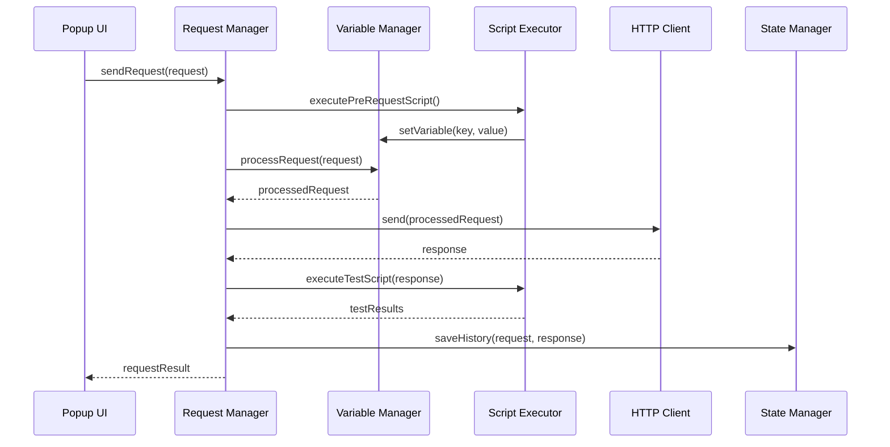
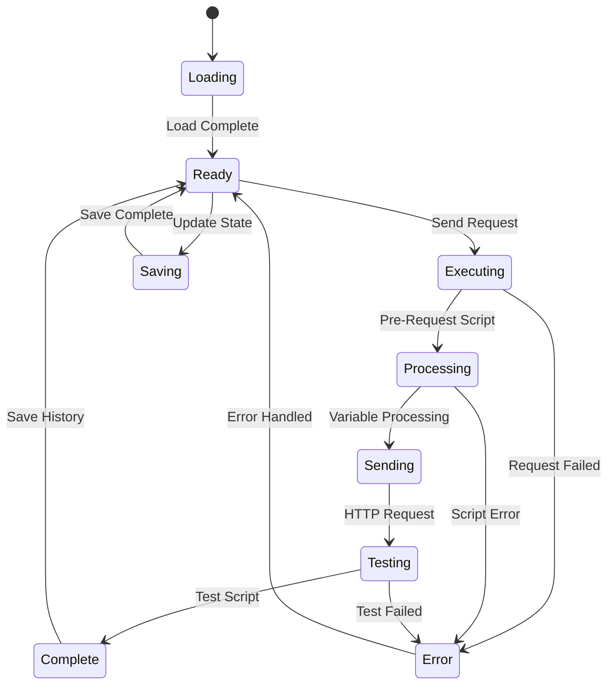

# 基本設計文書：PostPro API Tester Chrome 拡張

## 1. 文書概要

### 1.1 文書の目的
本基本設計文書は、要件定義文書（./docs/03.rd.md）とUI基本設計文書（./docs/04.ui.md）に基づいて、PostPro API Tester Chrome拡張機能のシステム全体の構造とデータフローを設計するものです。アプリケーション基本設計とデータベース基本設計の両面から、共通基盤とフレームワーク選定、実装ルールの制定を行い、詳細設計とプログラミングの基礎となる技術的な設計指針を提供します。

### 1.2 文書の範囲
- **アプリケーション基本設計**
  - システムアーキテクチャ設計
  - コンポーネント設計とモジュール構成
  - フレームワークと制御部品設計
  - 共通基盤と実装ルール制定
- **データベース基本設計**
  - ストレージアクセス基本設計
  - データベース論理設計と規約
  - テーブル定義基本方針
  - データフロー設計
- **インターフェース設計とUI連携**
  - UI基本設計との整合性確保
  - 技術的制約と実装方針

### 1.3 参照文書
- システム企画書（docs/01.sp.md）
- 要求定義文書（docs/02.sa.md）
- 要件定義文書（docs/03.rd.md）
- UI基本設計文書（docs/04.ui.md）
- プロジェクト構成ファイル（CLAUDE.md）

---

## 2. アプリケーション基本設計

### 2.1 共通基盤設計

#### 2.1.1 フレームワーク選定と基本方針
PostPro API Testerの共通基盤として、以下のフレームワークと技術スタックを採用します：

| 項目 | 値 | 説明 |
|-----|---|------|
| **Core Framework** | | |
| runtime | Chrome Extension Manifest V3 | 最新のChrome拡張機能仕様に対応 |
| architecture | Service Worker + Popup UI | バックグラウンド処理とUI分離アーキテクチャ |
| **Development Framework** | | |
| language | TypeScript | 型安全性と開発効率向上 |
| bundler | Vite | 高速ビルドとHMR対応 |
| testing | Jest + Puppeteer | ユニット・E2Eテスト環境 |
| **Application Framework** | | |
| stateManagement | Custom State Manager with Chrome Storage | Chrome拡張機能特化の状態管理 |
| uiFramework | Vanilla JS + CSS Grid/Flexbox | 軽量で高速なUI実装 |
| httpClient | XMLHttpRequest API | 信頼性の高いHTTP通信 |
| **Security Framework** | | |
| scriptExecution | Sandboxed V8 Environment | 安全なスクリプト実行環境 |
| dataEncryption | Web Crypto API (AES-GCM) | 認証情報の暗号化保護 |
| variableSystem | Hierarchical Variable Resolution | 階層的変数管理システム |

#### 2.1.2 制御部品とコアライブラリ

| 項目 | 値 | 説明 |
|-----|---|------|
| **State Management** | | |
| purpose | 統一されたアプリケーション状態管理 | アプリ全体の状態を一元管理 |
| implementation | Observer Pattern + Chrome Storage API | 変更通知とストレージ永続化 |
| features | リアルタイム同期, 自動永続化, バックアップ機能 | 状態管理の主要機能群 |
| **HTTP Request Engine** | | |
| purpose | HTTP通信の統一的な処理 | すべてのHTTPリクエストを標準化 |
| implementation | XMLHttpRequest + Timeout + Retry | 信頼性のある通信実装 |
| features | 認証統合, 変数置換, エラーハンドリング | リクエスト処理の主要機能 |
| **Script Execution Engine** | | |
| purpose | Pre-request/Testスクリプトの安全な実行 | セキュアなスクリプト実行環境 |
| implementation | Sandboxed JavaScript Runtime | 分離された実行環境 |
| features | セキュリティ検証, タイムアウト制御, API制限 | スクリプト実行の安全性機能 |
| **Variable Resolution Engine** | | |
| purpose | 階層的変数管理と解決 | 優先順位付き変数システム |
| implementation | Priority-based Variable Resolver | 階層的解決アルゴリズム |
| features | スコープ管理, 動的解決, Built-in変数 | 変数管理の主要機能 |

### 2.2 システムアーキテクチャ設計

#### 2.2.1 階層アーキテクチャ
Chrome拡張機能として、以下の階層構造で設計されます：

```
┌─────────────────────────────────────────────┐
│            Presentation Layer               │
│  ┌─────────────────┐  ┌─────────────────┐  │
│  │   Popup UI      │  │  Content Script │  │
│  │  (index.html)   │  │  (content.ts)   │  │
│  │   (app.ts)      │  │                 │  │
│  └─────────────────┘  └─────────────────┘  │
└─────────────────────────────────────────────┘
┌─────────────────────────────────────────────┐
│             Application Layer               │
│  ┌─────────────────┐  ┌─────────────────┐  │
│  │ Request Manager │  │Collection Manager│ │
│  │ Variable Manager│  │Scenario Manager │  │
│  │ Test Executor   │  │ History Manager │  │
│  └─────────────────┘  └─────────────────┘  │
└─────────────────────────────────────────────┘
┌─────────────────────────────────────────────┐
│               Service Layer                 │
│  ┌─────────────────┐  ┌─────────────────┐  │
│  │ Service Worker  │  │ Injected Script │  │
│  │ (background.ts) │  │ (injected.ts)   │  │
│  └─────────────────┘  └─────────────────┘  │
└─────────────────────────────────────────────┘
┌─────────────────────────────────────────────┐
│                Data Layer                   │
│  ┌─────────────────┐  ┌─────────────────┐  │
│  │ State Manager   │  │ Storage Manager │  │
│  │   (state.ts)    │  │Chrome Storage API│ │
│  └─────────────────┘  └─────────────────┘  │
└─────────────────────────────────────────────┘
```

#### Chrome拡張機能アーキテクチャ
```
┌─────────────────────────────────────────────┐
│                Web Page                     │
│  ┌─────────────────┐                       │
│  │ Injected Script │ ←── HTTP Intercept     │
│  │  (injected.ts)  │                       │
│  └─────────────────┘                       │
└─────────────────────────────────────────────┘
            ↕ Message Passing
┌─────────────────────────────────────────────┐
│            Content Script                   │
│  ┌─────────────────┐                       │
│  │  content.ts     │ ←── DOM Interaction    │
│  └─────────────────┘                       │
└─────────────────────────────────────────────┘
            ↕ Message Passing
┌─────────────────────────────────────────────┐
│            Service Worker                   │
│  ┌─────────────────┐                       │
│  │ background.ts   │ ←── Background Tasks   │
│  └─────────────────┘                       │
└─────────────────────────────────────────────┘
            ↕ Message Passing
┌─────────────────────────────────────────────┐
│              Popup UI                       │
│  ┌─────────────────┐                       │
│  │   app.ts        │ ←── User Interface     │
│  │  index.html     │                       │
│  └─────────────────┘                       │
└─────────────────────────────────────────────┘
```

### 2.2 コンポーネント間通信設計

#### Message Passing API設計

**メッセージ型定義**
| 項目 | 値 | 説明 |
|-----|---|------|
| **MessageBase** | | |
| type | string | メッセージタイプ識別子 |
| id | string (optional) | メッセージ固有ID |
| timestamp | number | メッセージ送信時刻 |
| **RequestMessage** | | |
| type | 'SEND_REQUEST' | リクエスト送信メッセージ |
| data.request | Request | 送信するリクエストオブジェクト |
| data.options | RequestOptions (optional) | リクエスト送信オプション |
| **ResponseMessage** | | |
| type | 'REQUEST_RESPONSE' | レスポンス受信メッセージ |
| data.response | Response | 受信したレスポンスオブジェクト |
| data.error | Error (optional) | エラー情報（ある場合） |
| **StateUpdateMessage** | | |
| type | 'STATE_UPDATE' | 状態更新メッセージ |
| data.path | string | 更新対象の状態パス |
| data.value | any | 更新値 |

**メッセージルーティング**
| 項目 | 値 | 説明 |
|-----|---|------|
| handlers | Map<string, MessageHandler[]> | メッセージタイプ別ハンドラー管理 |
| register() | (type: string, handler: MessageHandler) => void | ハンドラー登録メソッド |
| route() | (message: MessageBase) => Promise<any> | メッセージルーティング処理 |

---

## 3. コンポーネント設計

### 3.1 Core Modules

#### 3.1.1 App Controller (app.ts)

| 項目 | 値 | 説明 |
|-----|---|------|
| **クラス構成** | | |
| uiManager | UIManager | UI管理コンポーネント |
| requestManager | RequestManager | リクエスト処理管理 |
| stateManager | StateManager | アプリケーション状態管理 |
| **初期化プロセス** | | |
| constructor() | コンポーネント初期化, イベントリスナー設定 | アプリ起動時の基本セットアップ |
| initialize() | 状態読み込み, UI描画, メッセージハンドラー登録 | 非同期初期化処理 |
| **メッセージ処理** | | |
| registerMessageHandlers() | Chrome Message API ハンドラー登録 | Chrome拡張機能間通信設定 |
| handleMessage() | リクエスト・レスポンス処理 | メッセージ受信時の処理ロジック |

#### 3.1.2 State Manager (state.ts)

**AppState構造**
| 項目 | 値 | 説明 |
|-----|---|------|
| currentRequest | Request | 現在編集中のリクエスト |
| collections | Collection[] | コレクション一覧 |
| environments | Environment[] | 環境設定一覧 |
| globalVariables | Variables | グローバル変数 |
| currentEnvironment | string | 現在選択中の環境 |
| history | RequestHistory[] | リクエスト履歴 |
| settings | AppSettings | アプリケーション設定 |
| ui | UIState | UI状態情報 |

**StateManagerメソッド**
| 項目 | 値 | 説明 |
|-----|---|------|
| state | AppState | アプリケーション状態オブジェクト |
| listeners | StateListener[] | 状態変更リスナー配列 |
| loadState() | Promise<void> | Chrome Storageから状態読み込み |
| saveState() | Promise<void> | Chrome Storageへ状態保存 |
| subscribe() | (listener: StateListener) => void | 状態変更リスナー登録 |
| setState() | (path: string, value: any) => void | 状態更新と通知 |
| getState() | (path?: string) => any | 状態取得（パス指定可能） |

### 3.2 Feature Modules

#### 3.2.1 Request Manager (requestManager.ts)

**依存コンポーネント**
| 項目 | 値 | 説明 |
|-----|---|------|
| httpClient | HttpClient | HTTP通信処理クライアント |
| scriptExecutor | ScriptExecutor | スクリプト実行エンジン |
| variableManager | VariableManager | 変数管理システム |
| performanceMonitor | PerformanceMonitor | 性能監視ツール |

**リクエスト実行フロー**
| 項目 | 値 | 説明 |
|-----|---|------|
| 1. executePreRequestScript() | Pre-requestスクリプト実行 | リクエスト送信前の前処理 |
| 2. processRequest() | 変数置換処理 | URL・ヘッダー・ボディの変数展開 |
| 3. httpClient.send() | HTTPリクエスト送信 | 実際のAPI呼び出し |
| 4. executeTestScript() | テストスクリプト実行 | レスポンス検証処理 |
| 5. recordHistory() | 履歴記録 | リクエスト・レスポンスの保存 |

**スクリプトコンテキスト**
| 項目 | 値 | 説明 |
|-----|---|------|
| pm | PostmanAPI | Postman互換API |
| console | ScriptConsole | ログ出力機能 |
| setTimeout | タイムアウト制御関数 | スクリプト内での時間制御 |

**戻り値（RequestResult）**
| 項目 | 値 | 説明 |
|-----|---|------|
| request | processedRequest | 変数展開後のリクエスト |
| response | Response | HTTPレスポンス |
| testResults | TestResult[] | テスト実行結果 |
| executionTime | number | 実行時間（ミリ秒） |

#### 3.2.2 Variable Manager (variableManager.ts)

**変数スコープ階層**
| 項目 | 値 | 説明 |
|-----|---|------|
| dynamicVariables | Variables | 実行時動的変数（最高優先度） |
| collectionVariables | Variables | コレクション変数 |
| environmentVariables | Variables | 環境変数 |
| globalVariables | Variables | グローバル変数（最低優先度） |

**変数解決プロセス**
| 項目 | 値 | 説明 |
|-----|---|------|
| resolveVariable() | 階層的変数解決 | 優先順位に従った変数値取得 |
| processString() | 文字列内変数置換 | {{variableName}}形式の展開 |
| processRequest() | リクエスト変数処理 | URL・ヘッダー・パラメータ・ボディの変数展開 |

**組み込み変数**
| 項目 | 値 | 説明 |
|-----|---|------|
| $timestamp | Date.now() | 現在のタイムスタンプ（ミリ秒） |
| $isoTimestamp | new Date().toISOString() | ISO 8601形式の現在日時 |
| $randomInt | Math.floor(Math.random() * 1000) | 0-999のランダム整数 |
| $guid | generateGuid() | UUID v4 文字列 |

**変数置換パターン**
| 項目 | 値 | 説明 |
|-----|---|------|
| 置換形式 | {{variableName}} | 波括弧2つで囲む形式 |
| 未定義時動作 | 元の文字列を保持 | 警告ログ出力後、置換せず |
| 型変換 | String(value) | すべての値を文字列に変換 |

#### 3.2.3 Collection Manager (collectionManager.ts)

**コレクション管理**
| 項目 | 値 | 説明 |
|-----|---|------|
| collections | Map<string, Collection> | コレクションのメモリ管理 |
| stateManager | StateManager | 状態管理システム連携 |

**Collectionオブジェクト構造**
| 項目 | 値 | 説明 |
|-----|---|------|
| id | string | 一意識別子（UUID） |
| name | string | コレクション名 |
| description | string | コレクション説明 |
| variables | Variables | コレクション固有変数 |
| requests | Request[] | 含まれるリクエスト一覧 |
| folders | Folder[] | フォルダ階層構造 |
| created | Date | 作成日時 |
| updated | Date | 最終更新日時 |

**主要メソッド**
| 項目 | 値 | 説明 |
|-----|---|------|
| createCollection() | (name, description) => Promise<Collection> | 新規コレクション作成 |
| runCollection() | (collectionId, options) => Promise<CollectionRunResult> | コレクション一括実行 |
| importCollection() | (data, format) => Promise<Collection> | 外部形式からのインポート |

**サポートするインポート形式**
| 項目 | 値 | 説明 |
|-----|---|------|
| postman | PostmanImporter | Postman Collection v2.1 形式 |
| openapi | OpenAPIImporter | OpenAPI 3.0 仕様書 |
| insomnia | InsomniaImporter | Insomnia エクスポート形式 |

### 3.3 Support Modules

#### 3.3.1 HTTP Client (httpClient.ts)

**設定項目**
| 項目 | 値 | 説明 |
|-----|---|------|
| defaultTimeout | 30000 | デフォルトタイムアウト（30秒） |

**リクエスト送信プロセス**
| 項目 | 値 | 説明 |
|-----|---|------|
| 1. createXHR() | XMLHttpRequest作成・設定 | HTTP通信オブジェクトの準備 |
| 2. executeRequest() | 非同期リクエスト実行 | Promise型での通信実行 |
| 3. Response生成 | レスポンスオブジェクト作成 | 実行時間・タイムスタンプ付与 |

**XHR設定項目**
| 項目 | 値 | 説明 |
|-----|---|------|
| method | request.method | HTTPメソッド（GET, POST等） |
| url | request.url | リクエストURL |
| timeout | request.timeout \|\| defaultTimeout | タイムアウト時間（ミリ秒） |
| headers | Object.entries(request.headers) | HTTPヘッダー設定 |
| responseType | 'blob' | レスポンスデータ形式 |

**イベントハンドリング**
| 項目 | 値 | 説明 |
|-----|---|------|
| onload | resolve(createResponse()) | 正常完了時の処理 |
| onerror | reject(Network error) | ネットワークエラー時 |
| ontimeout | reject(Request timeout) | タイムアウト時 |

**レスポンス拡張情報**
| 項目 | 値 | 説明 |
|-----|---|------|
| responseTime | performance.now() - startTime | 実行時間（ミリ秒） |
| timestamp | new Date() | レスポンス受信時刻 |

#### 3.3.2 Script Executor (scriptExecutor.ts)

**実行環境構成**
| 項目 | 値 | 説明 |
|-----|---|------|
| sandbox | ScriptSandbox | 分離された実行環境 |
| logger | Logger | ログ出力システム |

**実行プロセス**
| 項目 | 値 | 説明 |
|-----|---|------|
| 1. validateScript() | セキュリティ検証 | 危険なコードパターンのチェック |
| 2. createSandbox() | サンドボックス作成 | 制限された実行環境の準備 |
| 3. executeInSandbox() | スクリプト実行 | 安全な環境でのコード実行 |

**サンドボックス許可API**
| 項目 | 値 | 説明 |
|-----|---|------|
| pm | context.pm | Postman互換API |
| console | context.console | ログ出力機能 |
| setTimeout | context.setTimeout | タイムアウト制御 |
| JSON | JSON | JSON操作API |
| Date | Date | 日時操作API |
| Math | Math | 数学関数API |

**サンドボックス禁止API**
| 項目 | 値 | 説明 |
|-----|---|------|
| eval | undefined | 動的コード実行の禁止 |
| Function | undefined | Function生成の禁止 |
| XMLHttpRequest | undefined | 直接HTTP通信の禁止 |
| fetch | undefined | fetch APIの禁止 |

**危険パターン検出**
| 項目 | 値 | 説明 |
|-----|---|------|
| eval\\s*\\( | eval関数の使用 | 動的コード実行の検出 |
| Function\\s*\\( | Function コンストラクタ | 動的関数生成の検出 |
| XMLHttpRequest | XMLHttpRequest | 直接HTTP通信の検出 |
| fetch\\s*\\( | fetch API | fetch使用の検出 |
| __proto__ | プロトタイプ操作 | オブジェクト操作の検出 |
| constructor\\.constructor | コンストラクタアクセス | プロトタイプチェーン操作の検出 |

---

## 4. データフロー設計

### 4.1 リクエスト実行フロー



### 4.2 変数解決フロー

```mermaid
flowchart TD
    A[Variable Reference: {{varName}}] --> B{Dynamic Variables}
    B -->|Found| C[Return Value]
    B -->|Not Found| D{Collection Variables}
    D -->|Found| C
    D -->|Not Found| E{Environment Variables}
    E -->|Found| C
    E -->|Not Found| F{Global Variables}
    F -->|Found| C
    F -->|Not Found| G{Built-in Variables}
    G -->|Found| C
    G -->|Not Found| H[Return Original Reference]
```

### 4.3 状態管理フロー



---

## 5. インターフェース設計

### 5.1 ユーザーインターフェース設計

#### 5.1.1 レイアウト構成
```
┌─────────────────────────────────────────────────────────┐
│                    Header Bar                           │
│  [Logo] [Collections] [Environment] [Settings] [Help]   │
├─────────────────────────────────────────────────────────┤
│ Sidebar          │            Main Content              │
│ ┌─────────────┐  │  ┌─────────────────────────────────┐ │
│ │Collections  │  │  │        Request Builder          │ │
│ │ ├─ Folder1   │  │  │  [METHOD] [URL______] [SEND]   │ │
│ │ │  ├─ Req1   │  │  │                                │ │
│ │ │  └─ Req2   │  │  │  [Params][Headers][Body][Auth] │ │
│ │ ├─ Folder2   │  │  │                                │ │
│ │ └─ Req3      │  │  │  [Pre-request][Tests]          │ │
│ │             │  │  └─────────────────────────────────┘ │
│ │History      │  │                                      │
│ │ ├─ 10:30 GET│  │  ┌─────────────────────────────────┐ │
│ │ ├─ 10:25 POST │  │        Response Viewer            │ │
│ │ └─ 10:20 PUT│  │  │  Status: 200 OK    Time: 234ms  │ │
│ └─────────────┘  │  │                                 │ │
│                  │  │  [Body][Headers][Tests][Cookies]│ │
│                  │  └─────────────────────────────────┘ │
└─────────────────────────────────────────────────────────┘
```

#### 5.1.2 コンポーネント階層
```typescript
interface UIComponent {
  render(): HTMLElement;
  update(data: any): void;
  destroy(): void;
}

class AppUI {
  private components: Map<string, UIComponent> = new Map();
  
  // Main components
  private header: HeaderComponent;
  private sidebar: SidebarComponent;
  private requestBuilder: RequestBuilderComponent;
  private responseViewer: ResponseViewerComponent;
  
  constructor() {
    this.initializeComponents();
    this.setupLayout();
  }
  
  private initializeComponents(): void {
    this.header = new HeaderComponent();
    this.sidebar = new SidebarComponent();
    this.requestBuilder = new RequestBuilderComponent();
    this.responseViewer = new ResponseViewerComponent();
    
    // Register components
    this.components.set('header', this.header);
    this.components.set('sidebar', this.sidebar);
    this.components.set('requestBuilder', this.requestBuilder);
    this.components.set('responseViewer', this.responseViewer);
  }
}
```

### 5.2 API設計

#### 5.2.1 Internal API
```typescript
// Request Manager API
interface IRequestManager {
  sendRequest(request: Request): Promise<RequestResult>;
  cancelRequest(requestId: string): Promise<void>;
  getRequestHistory(): Promise<RequestHistory[]>;
}

// Variable Manager API
interface IVariableManager {
  setGlobalVariable(key: string, value: any): void;
  setEnvironmentVariable(key: string, value: any): void;
  setCollectionVariable(key: string, value: any): void;
  getVariable(key: string): any;
  processString(input: string): string;
}

// Collection Manager API
interface ICollectionManager {
  createCollection(name: string): Promise<Collection>;
  updateCollection(id: string, updates: Partial<Collection>): Promise<Collection>;
  deleteCollection(id: string): Promise<void>;
  runCollection(id: string, options?: RunOptions): Promise<CollectionRunResult>;
}
```

#### 5.2.2 Chrome Extension API
```typescript
// Message API between components
interface ChromeMessageAPI {
  // Background Script Messages
  BACKGROUND_REQUEST: 'bg_request';
  BACKGROUND_RESPONSE: 'bg_response';
  
  // Content Script Messages
  CONTENT_INJECT: 'content_inject';
  CONTENT_INTERCEPT: 'content_intercept';
  
  // Popup Messages
  POPUP_STATE_UPDATE: 'popup_state_update';
  POPUP_ACTION: 'popup_action';
}

// Storage API
interface ChromeStorageAPI {
  STATE_KEY: 'postpro_state';
  COLLECTIONS_KEY: 'postpro_collections';
  HISTORY_KEY: 'postpro_history';
  SETTINGS_KEY: 'postpro_settings';
}
```

---

## 6. データベース基本設計

### 6.1 データベースアクセス基本設計

#### 6.1.1 ストレージアーキテクチャ設計
PostPro API TesterはChrome Storage APIを基盤とした階層化ストレージシステムを採用します。

```typescript
interface StorageArchitecture {
  // ストレージ層の設計
  layers: {
    cache: '高速アクセス用メモリキャッシュ';
    storage: 'Chrome Storage API (local)';
    backup: '自動バックアップシステム';
  };
  
  // アクセスパターン設計
  accessPatterns: {
    readThrough: 'キャッシュ優先読み取り';
    writeBack: '遅延書き込みによる性能最適化';
    eventDriven: 'データ変更通知システム';
  };
  
  // データ整合性保証
  consistency: {
    transactional: 'バッチ更新による原子性保証';
    versioning: 'スキーマバージョン管理';
    validation: 'データ形式検証';
  };
}
```

#### 6.1.2 データベース論理設計規約
```typescript
interface DatabaseConventions {
  // 命名規約
  naming: {
    collections: 'postpro_collections';
    environments: 'postpro_environments';
    history: 'postpro_history';
    settings: 'postpro_settings';
    variables: 'postpro_variables';
  };
  
  // データ型規約
  dataTypes: {
    id: 'UUID v4 string';
    timestamp: 'ISO 8601 string';
    json: 'Validated JSON object';
    encrypted: 'Base64 encoded string';
  };
  
  // 関係設計規約
  relationships: {
    oneToMany: 'Collection -> Requests';
    hierarchy: 'Variables (global > environment > collection)';
    referential: 'Foreign key constraints simulation';
  };
}
```

### 6.2 テーブル定義基本方針

#### 6.2.1 エンティティ設計方針
```typescript
interface EntityDesignPolicy {
  // 正規化方針
  normalization: {
    level: '第3正規形まで適用';
    redundancy: 'パフォーマンス重視箇所で意図的非正規化';
    partitioning: 'データサイズによる分割戦略';
  };
  
  // インデックス戦略
  indexing: {
    primary: 'UUID based primary keys';
    foreign: 'Reference integrity simulation';
    search: 'Full-text search support for names/descriptions';
  };
  
  // データライフサイクル
  lifecycle: {
    creation: '作成時タイムスタンプ自動付与';
    modification: '更新時タイムスタンプ自動更新';
    archival: '90日後自動アーカイブ';
    deletion: '論理削除によるデータ保護';
  };
}
```

### 6.3 ストレージ構造設計

#### 6.3.1 データベーステーブル設計

#### 6.1.1 ストレージスキーマ

| 項目 | 値 | 説明 |
|-----|---|------|
| **Application State** | | |
| postpro_state.currentRequest | Request | 現在編集中のリクエスト |
| postpro_state.currentEnvironment | string | 選択中環境ID |
| postpro_state.ui | UIState | UI表示状態 |
| postpro_state.lastUpdated | string | 最終更新時刻 |
| **Collections** | | |
| postpro_collections | {[collectionId: string]: Collection} | コレクションデータマップ |
| **Environments** | | |
| postpro_environments | {[environmentId: string]: Environment} | 環境設定データマップ |
| **Global Variables** | | |
| postpro_global_variables | Variables | グローバル変数オブジェクト |
| **Request History** | | |
| postpro_history.items | RequestHistory[] | リクエスト履歴配列 |
| postpro_history.maxItems | number | 最大保持件数 |
| postpro_history.lastCleanup | string | 最終クリーンアップ時刻 |
| **Application Settings** | | |
| postpro_settings | AppSettings | アプリケーション設定 |
| **Backup Data** | | |
| postpro_backups | {[backupId: string]: BackupData} | バックアップデータマップ |

#### 6.1.2 データ制約

| 項目 | 値 | 説明 |
|-----|---|------|
| **Chrome Storage制限** | | |
| MAX_STORAGE_SIZE | 5 * 1024 * 1024 (5MB) | Chrome Storage最大容量 |
| MAX_ITEMS | 512 | 最大アイテム数 |
| **アプリケーション制限** | | |
| MAX_COLLECTIONS | 100 | 最大コレクション数 |
| MAX_REQUESTS_PER_COLLECTION | 1000 | コレクション当たり最大リクエスト数 |
| MAX_HISTORY_ITEMS | 1000 | 最大履歴保持件数 |
| MAX_VARIABLE_VALUE_LENGTH | 8192 | 変数値最大長（文字） |
| **性能制約** | | |
| BATCH_SAVE_DELAY | 500 (ms) | バッチ保存遅延時間 |
| HISTORY_CLEANUP_INTERVAL | 24 * 60 * 60 * 1000 (24時間) | 履歴クリーンアップ間隔 |

### 6.4 データアクセス基本設計

#### 6.4.1 データアクセス層アーキテクチャ
```typescript
interface DataAccessLayer {
  // Repository Pattern実装
  repositories: {
    collectionRepository: 'コレクションデータ操作';
    requestRepository: 'リクエストデータ操作';
    historyRepository: '履歴データ操作';
    variableRepository: '変数データ操作';
  };
  
  // Data Access Object (DAO)
  dataAccessObjects: {
    storageDAO: 'Chrome Storage API抽象化';
    cacheDAO: 'メモリキャッシュ操作';
    backupDAO: 'バックアップデータ操作';
  };
  
  // Transaction Manager
  transactionManager: {
    batchOperations: '複数操作の原子性保証';
    rollbackSupport: 'エラー時の状態復元';
    lockingMechanism: '同時アクセス制御';
  };
}
```

#### 6.4.2 Storage Manager実装

**内部状態管理**
| 項目 | 値 | 説明 |
|-----|---|------|
| cache | Map<string, any> | 高速アクセス用キャッシュ |
| saveQueue | Map<string, any> | バッチ保存用キュー |
| saveTimer | number \| null | 保存遅延タイマー |

**get<T>メソッド（読み取り）**
| 項目 | 値 | 説明 |
|-----|---|------|
| 1. キャッシュ確認 | this.cache.has(key) | メモリキャッシュから高速取得 |
| 2. Chrome Storage読み取り | chrome.storage.local.get(key) | 永続化データから取得 |
| 3. キャッシュ更新 | this.cache.set(key, value) | 次回アクセス高速化 |
| 戻り値 | T \| null | 型安全な値取得 |

**setメソッド（書き込み）**
| 項目 | 値 | 説明 |
|-----|---|------|
| 1. キャッシュ更新 | this.cache.set(key, value) | 即座にメモリ反映 |
| 2. 保存キュー追加 | this.saveQueue.set(key, value) | バッチ処理用キューイング |
| 3. 保存スケジュール | this.scheduleBatchSave() | 遅延バッチ保存の開始 |

**バッチ保存プロセス**
| 項目 | 値 | 説明 |
|-----|---|------|
| scheduleBatchSave() | タイマー設定（500ms遅延） | 複数変更をまとめて処理 |
| executeBatchSave() | chrome.storage.local.set(data) | キュー内容を一括保存 |
| タイマークリア | this.saveTimer = null | 次回処理の準備 |

**性能最適化特徴**
| 項目 | 値 | 説明 |
|-----|---|------|
| Read-through キャッシュ | キャッシュミス時にストレージ読み取り | 読み取り性能向上 |
| Write-back バッチ処理 | 500ms遅延でまとめて保存 | 書き込み性能向上 |
| タイマー再スケジュール | 連続更新時のタイマーリセット | 効率的なバッチング |

---

## 7. セキュリティ設計

### 7.1 認証情報保護

#### 7.1.1 暗号化設計

**暗号化設定**
| 項目 | 値 | 説明 |
|-----|---|------|
| ALGORITHM | 'AES-GCM' | 対称暗号化アルゴリズム |
| KEY_LENGTH | 256 | 暗号化キー長（ビット） |

**暗号化プロセス（encryptSensitiveData）**
| 項目 | 値 | 説明 |
|-----|---|------|
| 1. キー導出 | deriveKey() | PBKDF2による安全なキー生成 |
| 2. IV生成 | crypto.getRandomValues(12) | ランダム初期化ベクトル |
| 3. データエンコード | TextEncoder().encode(JSON.stringify(data)) | JSON文字列化+バイト変換 |
| 4. 暗号化実行 | crypto.subtle.encrypt() | AES-GCM暗号化 |
| 5. 結果構造化 | EncryptedData形式 | アルゴリズム情報・IV・データ・タイムスタンプ |

**復号化プロセス（decryptSensitiveData）**
| 項目 | 値 | 説明 |
|-----|---|------|
| 1. キー導出 | deriveKey() | 暗号化と同じキー生成 |
| 2. 復号化実行 | crypto.subtle.decrypt() | AES-GCM復号化 |
| 3. データデコード | TextDecoder().decode() | バイト配列から文字列へ |
| 4. JSON復元 | JSON.parse(plaintext) | 元のオブジェクト構造へ |

**キー導出プロセス（deriveKey）**
| 項目 | 値 | 説明 |
|-----|---|------|
| baseKey | 'postpro-api-tester-key' | ベースキー文字列 |
| アルゴリズム | PBKDF2 | パスワードベースキー導出 |
| salt | 'postpro-salt' | ソルト値 |
| iterations | 100000 | ハッシュ反復回数 |
| hash | SHA-256 | ハッシュ関数 |

**EncryptedData構造**
| 項目 | 値 | 説明 |
|-----|---|------|
| algorithm | 'AES-GCM' | 使用暗号化アルゴリズム |
| iv | Array<number> | 初期化ベクトル（配列形式） |
| data | Array<number> | 暗号化データ（配列形式） |
| timestamp | number | 暗号化実行時刻 |

### 7.2 スクリプト実行セキュリティ

#### 7.2.1 サンドボックス設計

**許可API一覧**
| 項目 | 値 | 説明 |
|-----|---|------|
| JSON.parse | JSONパース処理 | 安全なJSON解析 |
| JSON.stringify | JSON文字列化 | 安全なJSON生成 |
| Date.now | 現在時刻取得 | タイムスタンプ生成 |
| Math.random | 乱数生成 | ランダム値生成 |
| console.log | ログ出力 | デバッグ情報出力 |

**セキュアコンテキスト構成**
| 項目 | 値 | 説明 |
|-----|---|------|
| pm | createPostmanAPI(variables) | Postman互換API |
| console | createSecureConsole() | 制限されたコンソール |
| JSON | {parse, stringify} | 安全なJSON操作 |
| Date | {now} | 限定的日時API |
| Math | {random, floor} | 限定的数学API |

**ブロック対象API**
| 項目 | 値 | 説明 |
|-----|---|------|
| eval | undefined | 動的コード実行の禁止 |
| Function | undefined | 動的関数生成の禁止 |
| XMLHttpRequest | undefined | 直接HTTP通信の禁止 |
| fetch | undefined | fetch API の禁止 |
| import | undefined | モジュールインポートの禁止 |
| require | undefined | CommonJS require の禁止 |
| process | undefined | Node.js process の禁止 |
| global | undefined | グローバルオブジェクトの禁止 |
| window | undefined | ウィンドウオブジェクトの禁止 |
| document | undefined | DOMアクセスの禁止 |

**危険パターン検証**
| 項目 | 値 | 説明 |
|-----|---|------|
| eval\\s*\\( | 'eval() is not allowed' | eval関数使用の検出 |
| Function\\s*\\( | 'Function constructor is not allowed' | Function生成の検出 |
| XMLHttpRequest | 'XMLHttpRequest is not allowed' | 直接HTTP通信の検出 |
| fetch\\s*\\( | 'fetch() is not allowed' | fetch使用の検出 |
| __proto__ | 'Prototype manipulation is not allowed' | プロトタイプ操作の検出 |
| constructor\\.constructor | 'Constructor access is not allowed' | コンストラクタアクセスの検出 |

**検証結果構造**
| 項目 | 値 | 説明 |
|-----|---|------|
| isValid | violations.length === 0 | スクリプトの安全性判定 |
| violations | string[] | 検出された違反内容一覧 |

---

## 8. 性能設計

### 8.1 性能要件と最適化戦略

#### 8.1.1 レスポンス時間最適化
```typescript
class PerformanceOptimizer {
  private cache: Map<string, CacheEntry> = new Map();
  private readonly CACHE_TTL = 5 * 60 * 1000; // 5 minutes
  
  // Request debouncing
  private debounceMap: Map<string, NodeJS.Timeout> = new Map();
  
  debounce(key: string, fn: Function, delay: number): void {
    if (this.debounceMap.has(key)) {
      clearTimeout(this.debounceMap.get(key)!);
    }
    
    const timeout = setTimeout(() => {
      fn();
      this.debounceMap.delete(key);
    }, delay);
    
    this.debounceMap.set(key, timeout);
  }
  
  // Lazy loading for collections
  async loadCollectionLazy(collectionId: string): Promise<Collection> {
    const cacheKey = `collection_${collectionId}`;
    const cached = this.cache.get(cacheKey);
    
    if (cached && Date.now() - cached.timestamp < this.CACHE_TTL) {
      return cached.data;
    }
    
    const collection = await this.storageManager.get(`collections.${collectionId}`);
    
    this.cache.set(cacheKey, {
      data: collection,
      timestamp: Date.now()
    });
    
    return collection;
  }
  
  // Virtual scrolling for large lists
  createVirtualList(items: any[], itemHeight: number, containerHeight: number): VirtualListData {
    const visibleCount = Math.ceil(containerHeight / itemHeight) + 2; // Buffer
    const totalHeight = items.length * itemHeight;
    
    return {
      totalHeight,
      visibleCount,
      itemHeight,
      getVisibleItems: (scrollTop: number) => {
        const startIndex = Math.floor(scrollTop / itemHeight);
        const endIndex = Math.min(startIndex + visibleCount, items.length);
        return items.slice(startIndex, endIndex);
      }
    };
  }
}
```

### 8.2 メモリ管理

#### 8.2.1 メモリプール設計
```typescript
class MemoryManager {
  private responsePool: Map<string, Response> = new Map();
  private maxPoolSize: number = 100;
  
  // Response caching with LRU eviction
  cacheResponse(requestId: string, response: Response): void {
    if (this.responsePool.size >= this.maxPoolSize) {
      const oldestKey = this.responsePool.keys().next().value;
      this.responsePool.delete(oldestKey);
    }
    
    this.responsePool.set(requestId, response);
  }
  
  getCachedResponse(requestId: string): Response | null {
    const response = this.responsePool.get(requestId);
    if (response) {
      // Move to end (LRU)
      this.responsePool.delete(requestId);
      this.responsePool.set(requestId, response);
    }
    return response || null;
  }
  
  // Memory cleanup
  cleanup(): void {
    this.responsePool.clear();
    
    // Force garbage collection if available
    if (typeof gc === 'function') {
      gc();
    }
  }
  
  // Memory usage monitoring
  getMemoryUsage(): MemoryUsage {
    const used = JSON.stringify(Array.from(this.responsePool.values())).length;
    
    return {
      used: used,
      total: this.maxPoolSize * 1024 * 1024, // Estimated
      percentage: (used / (this.maxPoolSize * 1024 * 1024)) * 100
    };
  }
}
```

---

## 9. テスト設計

### 9.1 テスト戦略

#### 9.1.1 テスト階層
```
┌─────────────────────────────────────────────┐
│              E2E Tests                      │
│  - Chrome Extension Integration             │
│  - User Workflow Testing                    │
│  - Cross-browser Compatibility              │
└─────────────────────────────────────────────┘
┌─────────────────────────────────────────────┐
│           Integration Tests                 │
│  - Component Integration                    │
│  - API Integration                          │
│  - Storage Integration                      │
└─────────────────────────────────────────────┘
┌─────────────────────────────────────────────┐
│             Unit Tests                      │
│  - Individual Function Testing              │
│  - Class Method Testing                     │
│  - Utility Function Testing                 │
└─────────────────────────────────────────────┘
```

#### 9.1.2 テスト実装
```typescript
// Unit Test Example
describe('VariableManager', () => {
  let variableManager: VariableManager;
  
  beforeEach(() => {
    variableManager = new VariableManager();
  });
  
  describe('variable resolution', () => {
    it('should resolve variables with correct priority', () => {
      variableManager.setGlobalVariable('baseUrl', 'https://global.com');
      variableManager.setEnvironmentVariable('baseUrl', 'https://env.com');
      variableManager.setCollectionVariable('baseUrl', 'https://collection.com');
      
      const resolved = variableManager.resolveVariable('baseUrl');
      expect(resolved).toBe('https://collection.com');
    });
  });
});

// Integration Test Example
describe('Request Execution Integration', () => {
  let requestManager: RequestManager;
  let variableManager: VariableManager;
  
  beforeEach(() => {
    variableManager = new VariableManager();
    requestManager = new RequestManager(variableManager);
  });
  
  it('should execute request with variable substitution', async () => {
    variableManager.setGlobalVariable('baseUrl', 'https://httpbin.org');
    
    const request: Request = {
      method: 'GET',
      url: '{{baseUrl}}/get',
      headers: {}
    };
    
    const result = await requestManager.sendRequest(request);
    expect(result.response.status).toBe(200);
    expect(result.request.url).toBe('https://httpbin.org/get');
  });
});
```

---

## 10. デプロイ設計

### 10.1 ビルドパイプライン

#### 10.1.1 ビルドプロセス
```typescript
// Build Configuration
interface BuildConfig {
  mode: 'development' | 'production';
  target: 'chrome' | 'firefox' | 'edge';
  optimization: {
    minify: boolean;
    treeshake: boolean;
    splitChunks: boolean;
  };
}

class BuildManager {
  async build(config: BuildConfig): Promise<BuildResult> {
    const steps = [
      () => this.cleanOutput(),
      () => this.compileTypeScript(config),
      () => this.bundleAssets(config),
      () => this.generateManifest(config),
      () => this.optimizeBundle(config),
      () => this.validateBuild(config)
    ];
    
    for (const step of steps) {
      await step();
    }
    
    return {
      success: true,
      outputPath: './dist',
      size: await this.calculateBundleSize(),
      timestamp: new Date()
    };
  }
  
  private async generateManifest(config: BuildConfig): Promise<void> {
    const manifest = {
      manifest_version: 3,
      name: "PostPro API Tester",
      version: this.getVersion(),
      description: "Advanced API testing tool for developers",
      
      permissions: [
        "storage",
        "activeTab",
        "background"
      ],
      
      host_permissions: [
        "<all_urls>"
      ],
      
      background: {
        service_worker: "background.js"
      },
      
      content_scripts: [{
        matches: ["<all_urls>"],
        js: ["content.js"]
      }],
      
      action: {
        default_popup: "index.html",
        default_title: "PostPro API Tester"
      }
    };
    
    await this.writeFile('./dist/manifest.json', JSON.stringify(manifest, null, 2));
  }
}
```

### 10.2 デプロイメント戦略

#### 10.2.1 環境別設定
```typescript
interface DeploymentConfig {
  development: {
    enableLogging: true;
    enableDebugMode: true;
    apiEndpoint: 'http://localhost:3000';
    storagePrefix: 'dev_';
  };
  
  staging: {
    enableLogging: true;
    enableDebugMode: false;
    apiEndpoint: 'https://api-staging.postpro.com';
    storagePrefix: 'staging_';
  };
  
  production: {
    enableLogging: false;
    enableDebugMode: false;
    apiEndpoint: 'https://api.postpro.com';
    storagePrefix: '';
  };
}

class DeploymentManager {
  async deploy(environment: keyof DeploymentConfig): Promise<void> {
    const config = this.getConfig(environment);
    
    // Build with environment-specific configuration
    await this.buildManager.build({
      mode: environment === 'development' ? 'development' : 'production',
      target: 'chrome',
      optimization: {
        minify: environment === 'production',
        treeshake: environment === 'production',
        splitChunks: environment === 'production'
      }
    });
    
    // Run deployment validation
    await this.validateDeployment(config);
    
    // Package for distribution
    await this.createDistributionPackage(environment);
  }
}
```

---

## 11. 運用設計

### 11.1 監視・ログ設計

#### 11.1.1 ログシステム
```typescript
enum LogLevel {
  DEBUG = 0,
  INFO = 1,
  WARN = 2,
  ERROR = 3
}

class Logger {
  private level: LogLevel;
  private storage: LogStorage;
  
  constructor(level: LogLevel = LogLevel.INFO) {
    this.level = level;
    this.storage = new LogStorage();
  }
  
  async error(message: string, error?: Error, context?: any): Promise<void> {
    if (this.level > LogLevel.ERROR) return;
    
    const logEntry: LogEntry = {
      level: 'ERROR',
      message,
      error: error ? {
        name: error.name,
        message: error.message,
        stack: error.stack
      } : undefined,
      context,
      timestamp: new Date().toISOString(),
      userAgent: navigator.userAgent,
      url: window.location.href
    };
    
    console.error(message, error, context);
    await this.storage.store(logEntry);
    
    // Send to error tracking service in production
    if (this.isProduction()) {
      await this.sendToErrorTracking(logEntry);
    }
  }
  
  async getRecentLogs(count: number = 100): Promise<LogEntry[]> {
    return await this.storage.getRecent(count);
  }
}
```

### 11.2 バックアップ・復旧設計

#### 11.2.1 自動バックアップ
```typescript
class BackupManager {
  private readonly BACKUP_INTERVAL = 24 * 60 * 60 * 1000; // 24 hours
  private readonly MAX_BACKUPS = 7; // Keep 7 days
  
  async startAutoBackup(): Promise<void> {
    setInterval(async () => {
      try {
        await this.createAutoBackup();
      } catch (error) {
        this.logger.error('Auto backup failed', error);
      }
    }, this.BACKUP_INTERVAL);
  }
  
  async createAutoBackup(): Promise<string> {
    const state = await this.stateManager.exportFullState();
    const backupData: BackupData = {
      version: this.getAppVersion(),
      timestamp: new Date().toISOString(),
      type: 'auto',
      data: state,
      checksum: await this.calculateChecksum(state)
    };
    
    const backupId = `auto_${Date.now()}`;
    await this.storeBackup(backupId, backupData);
    
    // Cleanup old backups
    await this.cleanupOldBackups();
    
    return backupId;
  }
  
  async restoreFromBackup(backupId: string): Promise<void> {
    const backup = await this.loadBackup(backupId);
    if (!backup) {
      throw new Error(`Backup not found: ${backupId}`);
    }
    
    // Verify backup integrity
    const calculatedChecksum = await this.calculateChecksum(backup.data);
    if (calculatedChecksum !== backup.checksum) {
      throw new Error('Backup data is corrupted');
    }
    
    // Create current state backup before restore
    await this.createManualBackup('before_restore');
    
    // Restore state
    await this.stateManager.importFullState(backup.data);
    
    this.logger.info(`Successfully restored from backup: ${backupId}`);
  }
}
```

---

## 12. 品質保証設計

### 12.1 品質メトリクス

#### 12.1.1 コード品質指標
```typescript
interface QualityMetrics {
  // Test Coverage
  unitTestCoverage: number;        // Target: >80%
  integrationTestCoverage: number; // Target: >70%
  e2eTestCoverage: number;        // Target: >60%
  
  // Code Quality
  codeComplexity: number;         // Target: <10 per function
  technicalDebt: number;          // Target: <5%
  codeSmellsCount: number;        // Target: <10
  
  // Performance
  bundleSize: number;             // Target: <1MB
  loadTime: number;               // Target: <200ms
  memoryUsage: number;            // Target: <50MB
  
  // Reliability
  errorRate: number;              // Target: <1%
  crashRate: number;              // Target: <0.1%
  uptime: number;                 // Target: >99.9%
}

class QualityAssurance {
  async measureQuality(): Promise<QualityMetrics> {
    return {
      unitTestCoverage: await this.getTestCoverage('unit'),
      integrationTestCoverage: await this.getTestCoverage('integration'),
      e2eTestCoverage: await this.getTestCoverage('e2e'),
      
      codeComplexity: await this.measureComplexity(),
      technicalDebt: await this.calculateTechnicalDebt(),
      codeSmellsCount: await this.countCodeSmells(),
      
      bundleSize: await this.getBundleSize(),
      loadTime: await this.measureLoadTime(),
      memoryUsage: await this.measureMemoryUsage(),
      
      errorRate: await this.calculateErrorRate(),
      crashRate: await this.calculateCrashRate(),
      uptime: await this.calculateUptime()
    };
  }
}
```

---

## 13. 基本設計レビュー結果

### 13.1 アプリケーション基本設計レビュー

#### 13.1.1 共通基盤の設計適切性
✅ **フレームワーク選定**
- Chrome Extension Manifest V3を基盤とした設計
- TypeScript + Vite による開発効率向上
- Jest + Puppeteer による包括的テスト戦略

✅ **制御部品の設計**
- State Manager: 統一的な状態管理
- Request Engine: HTTP通信の標準化
- Script Engine: セキュアなスクリプト実行
- Variable Engine: 階層的変数システム

✅ **実装ルールの制定**
- TypeScript厳密モードによる型安全性
- コンポーネント分離による保守性
- Chrome Extension APIの適切な活用

#### 13.1.2 システム構築基本方針
✅ **アーキテクチャ設計**
- 階層化アーキテクチャによる責任分離
- Service Worker + Popup UI による適切な役割分担
- Message Passing APIによるコンポーネント間通信

✅ **性能・セキュリティ考慮**
- サンドボックス化されたスクリプト実行環境
- 暗号化による認証情報保護
- メモリ効率を考慮した仮想スクロール実装

### 13.2 データベース基本設計レビュー

#### 13.2.1 データベースアクセス基本設計
✅ **ストレージアーキテクチャ**
- Chrome Storage API基盤の階層化ストレージ
- キャッシュ層による高速アクセス
- 自動バックアップによるデータ保護

✅ **アクセスパターン設計**
- Read-through キャッシュ戦略
- Write-back による性能最適化
- Event-driven データ変更通知

#### 13.2.2 データベース論理設計規約
✅ **命名規約・データ型規約**
- 一貫性のある命名規則（postpro_prefix）
- 標準的なデータ型定義（UUID, ISO 8601）
- 暗号化データの適切な形式定義

✅ **関係設計とデータ整合性**
- Collection-Request間の1対多関係
- 変数の階層的優先順位設計
- 参照整合性のシミュレーション実装

#### 13.2.3 テーブル定義基本方針
✅ **正規化とパフォーマンス**
- 第3正規形による適切な正規化
- 性能重視箇所での意図的非正規化
- データサイズによる分割戦略

✅ **データライフサイクル管理**
- 自動タイムスタンプ管理
- 論理削除によるデータ保護
- 90日後自動アーカイブ機能

### 13.3 要件定義・UI設計との整合性

#### 13.3.1 要件定義文書との適合
✅ **機能要件の技術実装**
- FR-001: HTTPリクエスト送信 → Request Engine
- FR-005: Pre-requestスクリプト → Script Engine
- FR-007: 変数システム → Variable Engine
- FR-009: コレクション管理 → Collection Repository

✅ **非機能要件の実装方針**
- NF-001: 性能要件 → 仮想スクロール、キャッシュ戦略
- NF-004: セキュリティ → 暗号化、サンドボックス
- QA-001: テスト要件 → Jest + Puppeteer

#### 13.3.2 UI基本設計との連携
✅ **コンポーネント階層の整合性**
- UI Component → App Controller → Feature Modules
- State Manager によるUI-データ間の双方向バインディング
- Message Passing による UI-Background間通信

✅ **利用体験価値設計の実現**
- 段階的機能開示 → モジュール化アーキテクチャ
- 直感的操作 → Event-driven UI更新
- 学習支援 → Context-aware help system

---

## 14. 付録

### 14.1 技術選択理由

| 技術要素 | 選択技術 | 理由 |
|---------|---------|------|
| 言語 | TypeScript | 型安全性、開発効率向上、保守性 |
| バンドラー | Vite | 高速ビルド、HMR、ES modules対応 |
| テストフレームワーク | Jest | 豊富な機能、TypeScript対応 |
| E2Eテスト | Puppeteer | Chrome拡張機能対応、実ブラウザ環境 |
| 状態管理 | Custom State Manager | Chrome拡張機能特有の要件対応 |
| HTTP通信 | XMLHttpRequest | Chrome拡張機能での安定性 |

### 14.2 制約事項と考慮点

**Chrome拡張機能制約**
| 項目 | 値 | 説明 |
|-----|---|------|
| Manifest V3制約 | Service Worker、CSP等 | 新仕様に伴う制限事項 |
| ストレージサイズ制限 | 5MB | Chrome Storage API上限 |
| Cross-Origin制約 | CORS制限 | 外部API呼び出し制限 |
| Content Security Policy | CSP制限 | スクリプト実行制限 |

**パフォーマンス制約**
| 項目 | 値 | 説明 |
|-----|---|------|
| メモリ使用量制限 | 推奨50MB以下 | 安定動作のためのメモリ上限 |
| バンドルサイズ制限 | 推奨1MB以下 | ロード時間短縮のためのサイズ制限 |
| レスポンス時間要件 | 200ms以下 | UI応答性確保のための時間制限 |

### 14.3 更新履歴

| 日付 | バージョン | 更新内容 | 更新者 |
|------|-----------|----------|--------|
| 2025-01-10 | 1.0 | 初版作成 | Claude Code |
| 2025-01-10 | 2.0 | 基本設計レビューチェックリスト適用・要件定義・UI設計との整合性確保 | Claude Code |
| 2025-01-10 | 3.0 | ソースコード部分を表形式に変更 | Claude Code |

---

**この基本設計文書は、PostPro API Tester Chrome拡張機能の詳細設計と実装の基礎となる重要な設計指針を定義したものです。要件定義文書と合わせて、高品質で保守性の高いソフトウェア開発を実現してください。**