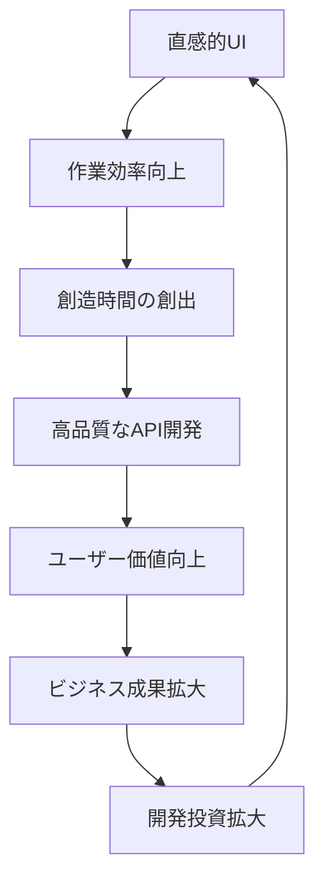

# UI基本設計文書：PostPro API Tester Chrome 拡張

## 1. 文書概要

### 1.1 文書の目的
本UI基本設計文書は、PostPro API Tester Chrome拡張機能のユーザーインターフェースを具体的に設計し、**利用者の価値創造と業務効率化**を最大化することを目指します。API開発・テストという専門的な作業を、より直感的で効率的な体験に変革し、開発者の創造性と生産性を向上させるUI設計を提供します。

### 1.2 文書の範囲
- **利用体験価値設計** - ユーザーの価値創造シナリオ定義
- **現行ツール課題分析** - 既存API開発ツールの問題点評価
- **次世代UI体験設計** - 理想的な利用体験の具体的設計
- **ビジュアルデザイン仕様** - 視覚的設計とブランド一貫性
- **インタラクション設計** - 直感的操作フローと効率性
- **アクセシビリティ設計** - 包括的利用可能性の実現
- **ユーザビリティ検証計画** - 継続的改善のための評価体系

### 1.3 参照文書
- システム企画書（docs/01.sp.md）
- 要求定義文書（docs/02.sa.md）
- 要件定義文書（docs/03.rd.md）
- 基本設計文書（docs/03.bd.md）
- プロジェクト構成ファイル（CLAUDE.md）

---

## 2. 利用体験価値設計

### 2.1 現行システムの課題分析

#### 2.1.1 既存API開発ツールの問題点
```
【調査対象：主要APIクライアントツール】
- Postman Desktop版
- Insomnia
- Thunder Client（VS Code拡張）
- curl command line
- ブラウザ開発者ツール

【共通課題の特定】
```

**1. 複雑性による認知負荷**
```
課題：
- 多機能すぎて初心者が迷う
- 基本的なAPIテストに不要な機能が前面に
- 学習コストが高く、簡単なテストに時間がかかる

理想：
- 段階的な機能開示（Progressive Disclosure）
- 最頻使用機能への即座アクセス
- コンテキストに応じた適切な情報表示
```

**2. ワークフロー効率性の問題**
```
課題：
- リクエスト作成から結果確認まで多クリック必要
- 環境切り替えが煩雑
- テスト結果の保存・共有が複雑

理想：
- ワンクリックでのAPIテスト実行
- シームレスな環境切り替え
- 自動的な結果保存と簡単共有
```

**3. コラボレーション機能の制限**
```
課題：
- チーム間でのAPI仕様共有が困難
- テスト結果の共有方法が限定的
- リアルタイム協業機能の不足

理想：
- APIドキュメントとテストの統合
- 即座共有可能なテスト結果
- チーム内での知識共有促進
```

#### 2.1.2 利用者を取り巻く環境分析
```typescript
interface UserContext {
  // 開発環境の変化
  developmentTrends: {
    apiFirst: 'API設計優先のアプローチ増加';
    microservices: 'マイクロサービス化による複雑性';
    agile: 'アジャイル開発での迅速テスト需要';
    remote: 'リモート開発環境での協業重要性';
  };
  
  // 時間的制約
  timeConstraints: {
    developmentSpeed: '開発スピード向上の要求';
    bugTesting: '短時間でのバグ再現・確認';
    integration: 'CI/CD統合での自動化需要';
  };
  
  // スキルレベルの多様性
  skillDiversity: {
    junior: '新人開発者の学習支援必要';
    senior: 'エキスパート向け高度機能';
    nonTechnical: '非技術者でも理解可能なUI';
  };
}
```

### 2.2 次世代利用体験の定義

#### 2.2.1 価値創造シナリオ

**シナリオ1：新人開発者の学習促進**
```
【現状の問題】
新人開発者がAPIテストツールを使う際の困難
- 複雑なインターフェースで何から始めればよいかわからない
- エラーメッセージが技術的すぎて理解困難
- APIの概念自体の理解が不十分

【PostProの価値提供】
1. ガイド付き初回体験
   - インタラクティブチュートリアル
   - エコーAPIを使った安全な学習環境
   - 段階的な機能習得サポート

2. 学習支援機能
   - わかりやすいエラー説明と解決提案
   - HTTPメソッドやステータスコードの説明
   - ベストプラクティスの提示

3. 成功体験の創出
   - 初回から成功するよう設計されたUX
   - 達成感を得られる進捗表示
   - 実用的なサンプルリクエスト集
```

**シナリオ2：チーム開発での生産性向上**
```
【現状の問題】
チーム間でのAPI仕様・テスト情報共有の非効率性
- メンバー間でのテスト手順の共有が困難
- API変更時の影響範囲把握が困難
- テスト結果の記録・共有が属人的

【PostProの価値提供】
1. シームレスな共有機能
   - ワンクリックでのコレクション共有
   - テスト結果の自動記録・検索
   - チーム内でのベストプラクティス蓄積

2. 協業促進インターフェース
   - 直感的なコレクション管理
   - 変更履歴の可視化
   - リアルタイムな状況共有

3. 品質向上支援
   - 自動化されたテストシナリオ
   - 継続的な品質監視
   - 問題の早期発見・対処
```

**シナリオ3：迅速なデバッグ・問題解決**
```
【現状の問題】
本番環境での問題発生時の迅速対応困難
- 問題再現のための環境構築に時間
- 複雑な認証設定の再構築
- ログと実際のリクエストの関連付け困難

【PostProの価値提供】
1. 即座の問題再現
   - 保存済み環境の瞬時切り替え
   - 認証情報の安全な管理・再利用
   - ログ情報からのリクエスト再構築

2. 効率的なデバッグワークフロー
   - レスポンス差分の自動比較
   - エラーパターンの学習・提案
   - 解決策の知識ベース構築

3. 予防的品質管理
   - 定期的な自動テスト実行
   - 性能劣化の早期検知
   - 依存関係の影響分析
```

#### 2.2.2 システム全体の目指す姿

**ビジョン：「API開発を創造的な活動に変革する」**
```
現在：技術的作業としてのAPIテスト
├── 手順の暗記が必要
├── エラー対応に時間消費
├── 単調な繰り返し作業
└── 成果物の共有が困難

↓ PostProによる変革

未来：創造的活動としてのAPI開発
├── 直感的な操作で集中力維持
├── 自動化による高付加価値作業への集中
├── チーム知見の蓄積・活用
└── 継続的な品質向上
```

**価値創造の循環**


---

## 3. UI設計原則

### 3.1 利用体験中心設計

#### 3.1.1 体験価値重視の原則
```
価値創造最優先の設計
┌─────────────────────────────────────────────┐
│ • ユーザーの目標達成を最短経路でサポート      │
│ • 創造的作業に集中できる環境の提供           │
│ • 学習コストを最小化した直感的操作           │
│ • 成功体験を積み重ねる段階的習得支援         │
└─────────────────────────────────────────────┘

協業促進の設計思想
┌─────────────────────────────────────────────┐
│ • チーム知見の蓄積・共有を自然に促進         │
│ • 非同期協業をスムーズに支援                │
│ • ベストプラクティスの自然な伝播             │
│ • 品質向上の継続的なサイクル構築             │
└─────────────────────────────────────────────┘

持続可能な成長設計
┌─────────────────────────────────────────────┐
│ • 利用者の成長に合わせた機能展開             │
│ • 組織の発展段階に応じたスケーラビリティ     │
│ • 技術進歩に対応する柔軟な拡張性             │
│ • エコシステム連携による価値増大             │
└─────────────────────────────────────────────┘
```

#### 3.1.2 利用体験最適化原則
```typescript
interface ExperienceOptimizationPrinciples {
  // Value Creation: 価値創造支援
  valueCreation: {
    goalAchievementPath: 'ユーザーの目標達成まで最短3ステップ';
    contextualGuidance: '状況に応じた適切なガイダンス提供';
    successAmplification: '成功体験の増幅と記録';
    learningSupport: '自然な学習機会の組み込み';
  };
  
  // Cognitive Wellness: 認知的負荷軽減
  cognitiveWellness: {
    informationArchitecture: '情報の論理的階層化';
    progressiveDisclosure: '段階的な複雑性提示';
    contextualRelevance: 'コンテキスト適応型UI';
    memorySupport: '記憶に頼らない操作設計';
  };
  
  // Flow State: 集中状態の維持
  flowState: {
    interruptionMinimization: '不要な中断の排除';
    feedbackLoop: 'リアルタイム適切フィードバック';
    taskContinuity: 'タスクの自然な連続性';
    immersiveExperience: '没入感のある操作体験';
  };
  
  // Collaborative Intelligence: 集合知の活用
  collaborativeIntelligence: {
    knowledgeSharing: 'チーム知見の自動蓄積・活用';
    bestPracticePromotion: 'ベストプラクティスの自然な浸透';
    collectiveLearning: '組織学習の促進';
    qualityEvolution: '品質の継続的進化';
  };
}
```

### 3.2 カラーパレット設計

#### 2.2.1 プライマリーカラー
```css
:root {
  /* Primary Colors - ブランドアイデンティティ */
  --primary-blue: #2563eb;      /* アクション・選択状態 */
  --primary-blue-light: #3b82f6;
  --primary-blue-dark: #1d4ed8;
  
  /* Secondary Colors - 補助的なアクション */
  --secondary-gray: #64748b;    /* セカンダリーボタン */
  --secondary-gray-light: #94a3b8;
  --secondary-gray-dark: #475569;
  
  /* Semantic Colors - 意味を持つ色 */
  --success-green: #10b981;     /* 成功・正常状態 */
  --success-green-light: #34d399;
  --success-green-bg: #ecfdf5;
  
  --warning-yellow: #f59e0b;    /* 警告・注意 */
  --warning-yellow-light: #fbbf24;
  --warning-yellow-bg: #fffbeb;
  
  --error-red: #ef4444;         /* エラー・失敗 */
  --error-red-light: #f87171;
  --error-red-bg: #fef2f2;
  
  --info-cyan: #06b6d4;         /* 情報・ヒント */
  --info-cyan-light: #22d3ee;
  --info-cyan-bg: #ecfeff;
}
```

#### 2.2.2 ニュートラルカラー
```css
:root {
  /* Neutral Colors - テキスト・背景 */
  --neutral-white: #ffffff;
  --neutral-gray-50: #f8fafc;
  --neutral-gray-100: #f1f5f9;
  --neutral-gray-200: #e2e8f0;
  --neutral-gray-300: #cbd5e1;
  --neutral-gray-400: #94a3b8;
  --neutral-gray-500: #64748b;
  --neutral-gray-600: #475569;
  --neutral-gray-700: #334155;
  --neutral-gray-800: #1e293b;
  --neutral-gray-900: #0f172a;
  
  /* Text Colors */
  --text-primary: var(--neutral-gray-900);
  --text-secondary: var(--neutral-gray-600);
  --text-muted: var(--neutral-gray-500);
  --text-inverse: var(--neutral-white);
  
  /* Background Colors */
  --bg-primary: var(--neutral-white);
  --bg-secondary: var(--neutral-gray-50);
  --bg-muted: var(--neutral-gray-100);
  --bg-card: var(--neutral-white);
  
  /* Border Colors */
  --border-light: var(--neutral-gray-200);
  --border-medium: var(--neutral-gray-300);
  --border-dark: var(--neutral-gray-400);
}
```

### 3.3 タイポグラフィシステム

#### 2.3.1 フォント階層
```css
:root {
  /* Font Families */
  --font-sans: 'Inter', 'Noto Sans JP', -apple-system, BlinkMacSystemFont, sans-serif;
  --font-mono: 'JetBrains Mono', 'SF Mono', 'Monaco', Consolas, monospace;
  
  /* Font Sizes - Type Scale */
  --text-xs: 0.75rem;    /* 12px - 小さな補助テキスト */
  --text-sm: 0.875rem;   /* 14px - 本文・ラベル */
  --text-base: 1rem;     /* 16px - 標準本文 */
  --text-lg: 1.125rem;   /* 18px - 小見出し */
  --text-xl: 1.25rem;    /* 20px - 見出し */
  --text-2xl: 1.5rem;    /* 24px - 大見出し */
  --text-3xl: 1.875rem;  /* 30px - タイトル */
  
  /* Line Heights */
  --leading-tight: 1.25;
  --leading-normal: 1.5;
  --leading-relaxed: 1.625;
  
  /* Font Weights */
  --font-light: 300;
  --font-normal: 400;
  --font-medium: 500;
  --font-semibold: 600;
  --font-bold: 700;
}
```

#### 2.3.2 テキストスタイル定義
```css
/* Heading Styles */
.text-title {
  font-size: var(--text-3xl);
  font-weight: var(--font-bold);
  line-height: var(--leading-tight);
  color: var(--text-primary);
}

.text-heading {
  font-size: var(--text-2xl);
  font-weight: var(--font-semibold);
  line-height: var(--leading-tight);
  color: var(--text-primary);
}

.text-subheading {
  font-size: var(--text-xl);
  font-weight: var(--font-medium);
  line-height: var(--leading-normal);
  color: var(--text-primary);
}

/* Body Text Styles */
.text-body {
  font-size: var(--text-base);
  font-weight: var(--font-normal);
  line-height: var(--leading-normal);
  color: var(--text-primary);
}

.text-body-small {
  font-size: var(--text-sm);
  font-weight: var(--font-normal);
  line-height: var(--leading-normal);
  color: var(--text-secondary);
}

.text-caption {
  font-size: var(--text-xs);
  font-weight: var(--font-normal);
  line-height: var(--leading-normal);
  color: var(--text-muted);
}

/* Code Text Styles */
.text-code {
  font-family: var(--font-mono);
  font-size: var(--text-sm);
  background-color: var(--bg-muted);
  padding: 0.125rem 0.25rem;
  border-radius: 0.25rem;
}
```

---

## 4. レイアウト設計

### 4.1 全体レイアウト構造

#### 4.1.1 メイングリッドシステム
```
┌─────────────────────────────────────────────────────────┐
│                     Header (固定: 64px)                │
├─────────────────────────────────────────────────────────┤
│ Sidebar        │            Main Content               │
│ (固定: 280px)   │         (可変幅)                      │
│                │                                        │
│ ┌─────────────┐│  ┌─────────────────────────────────┐   │
│ │Collections  ││  │        Request Panel            │   │
│ │ ├─ API Tests ││  │  ┌─────────────────────────────┐│   │
│ │ ├─ E-Commerce││  │  │ [GET] [URL] [Send]         ││   │
│ │ └─ User Auth ││  │  └─────────────────────────────┘│   │
│ │             ││  │                                 │   │
│ │History      ││  │  ┌─────────────────────────────┐│   │
│ │ ├─ 14:30 GET││  │  │ Request Tabs                ││   │
│ │ ├─ 14:25 POST│  │  │ [Params][Headers][Body]     ││   │
│ │ └─ 14:20 PUT││  │  └─────────────────────────────┘│   │
│ └─────────────┘│  └─────────────────────────────────┘   │
│                │                                        │
│                │  ┌─────────────────────────────────┐   │
│                │  │        Response Panel           │   │
│                │  │  Status: 200 OK   Time: 234ms  │   │
│                │  │  ┌─────────────────────────────┐│   │
│                │  │  │ [Body][Headers][Tests]      ││   │
│                │  │  └─────────────────────────────┘│   │
│                │  └─────────────────────────────────┘   │
│                │                                        │
└─────────────────────────────────────────────────────────┘
```

#### 4.1.2 レスポンシブブレークポイント
```css
:root {
  /* Breakpoints */
  --bp-sm: 640px;   /* Small tablets */
  --bp-md: 768px;   /* Large tablets */
  --bp-lg: 1024px;  /* Small laptops */
  --bp-xl: 1280px;  /* Desktops */
  --bp-2xl: 1536px; /* Large screens */
  
  /* Container widths */
  --container-sm: 100%;
  --container-md: 100%;
  --container-lg: 100%;
  --container-xl: 1200px;
  --container-2xl: 1400px;
  
  /* Sidebar responsive behavior */
  --sidebar-width-mobile: 0px;      /* Hidden on mobile */
  --sidebar-width-tablet: 240px;    /* Narrow on tablet */
  --sidebar-width-desktop: 280px;   /* Full width on desktop */
}
```

### 4.2 コンポーネントレイアウト

#### 4.2.1 ヘッダーコンポーネント
```html
<!-- Header Component Structure -->
<header class="app-header">
  <div class="header-container">
    <!-- Logo & Brand -->
    <div class="header-brand">
      
      <span class="brand-text">PostPro API Tester</span>
    </div>
    
    <!-- Environment Selector -->
    <div class="header-environment">
      <select class="env-selector">
        <option value="development">Development</option>
        <option value="staging">Staging</option>
        <option value="production">Production</option>
      </select>
    </div>
    
    <!-- Header Actions -->
    <div class="header-actions">
      <button class="btn-icon" data-action="import">
        <i class="icon-upload"></i>
      </button>
      <button class="btn-icon" data-action="export">
        <i class="icon-download"></i>
      </button>
      <button class="btn-icon" data-action="settings">
        <i class="icon-settings"></i>
      </button>
    </div>
  </div>
</header>
```

```css
.app-header {
  height: 64px;
  background: var(--bg-primary);
  border-bottom: 1px solid var(--border-light);
  position: sticky;
  top: 0;
  z-index: 100;
}

.header-container {
  display: flex;
  align-items: center;
  justify-content: space-between;
  height: 100%;
  padding: 0 1rem;
}

.header-brand {
  display: flex;
  align-items: center;
  gap: 0.75rem;
}

.logo {
  width: 32px;
  height: 32px;
}

.brand-text {
  font-size: var(--text-lg);
  font-weight: var(--font-semibold);
  color: var(--text-primary);
}

.env-selector {
  padding: 0.5rem 0.75rem;
  border: 1px solid var(--border-medium);
  border-radius: 0.375rem;
  background: var(--bg-primary);
  font-size: var(--text-sm);
}

.header-actions {
  display: flex;
  gap: 0.5rem;
}

.btn-icon {
  width: 40px;
  height: 40px;
  display: flex;
  align-items: center;
  justify-content: center;
  border: none;
  background: transparent;
  border-radius: 0.375rem;
  color: var(--text-secondary);
  transition: all 0.2s;
  cursor: pointer;
}

.btn-icon:hover {
  background: var(--bg-muted);
  color: var(--text-primary);
}
```

#### 4.2.2 サイドバーコンポーネント
```html
<!-- Sidebar Component Structure -->
<aside class="app-sidebar">
  <!-- Collections Section -->
  <div class="sidebar-section">
    <div class="section-header">
      <h3 class="section-title">Collections</h3>
      <button class="btn-icon-sm" data-action="add-collection">
        <i class="icon-plus"></i>
      </button>
    </div>
    
    <div class="collection-tree">
      <div class="collection-item">
        <div class="item-header" data-collapsible>
          <i class="icon-folder-open"></i>
          <span class="item-name">API Tests</span>
          <button class="btn-icon-xs" data-action="collection-menu">
            <i class="icon-more"></i>
          </button>
        </div>
        
        <div class="item-content">
          <div class="request-item">
            <div class="request-method method-get">GET</div>
            <span class="request-name">Get Users</span>
          </div>
          <div class="request-item">
            <div class="request-method method-post">POST</div>
            <span class="request-name">Create User</span>
          </div>
        </div>
      </div>
    </div>
  </div>
  
  <!-- History Section -->
  <div class="sidebar-section">
    <div class="section-header">
      <h3 class="section-title">History</h3>
      <button class="btn-icon-sm" data-action="clear-history">
        <i class="icon-trash"></i>
      </button>
    </div>
    
    <div class="history-list">
      <div class="history-item">
        <div class="history-method method-get">GET</div>
        <div class="history-details">
          <div class="history-url">/api/users</div>
          <div class="history-time">14:30</div>
        </div>
        <div class="history-status status-success">200</div>
      </div>
    </div>
  </div>
</aside>
```

```css
.app-sidebar {
  width: var(--sidebar-width-desktop);
  background: var(--bg-secondary);
  border-right: 1px solid var(--border-light);
  height: calc(100vh - 64px);
  overflow-y: auto;
  padding: 1rem;
}

.sidebar-section {
  margin-bottom: 2rem;
}

.section-header {
  display: flex;
  align-items: center;
  justify-content: space-between;
  margin-bottom: 0.75rem;
}

.section-title {
  font-size: var(--text-sm);
  font-weight: var(--font-semibold);
  color: var(--text-secondary);
  text-transform: uppercase;
  letter-spacing: 0.05em;
}

.collection-item {
  margin-bottom: 0.5rem;
}

.item-header {
  display: flex;
  align-items: center;
  gap: 0.5rem;
  padding: 0.5rem;
  border-radius: 0.375rem;
  cursor: pointer;
  transition: background-color 0.2s;
}

.item-header:hover {
  background: var(--bg-muted);
}

.item-content {
  margin-left: 1.5rem;
  border-left: 1px solid var(--border-light);
  padding-left: 0.75rem;
}

.request-item {
  display: flex;
  align-items: center;
  gap: 0.5rem;
  padding: 0.375rem 0.5rem;
  border-radius: 0.25rem;
  cursor: pointer;
  transition: background-color 0.2s;
}

.request-item:hover {
  background: var(--bg-primary);
}

.request-method {
  padding: 0.125rem 0.375rem;
  border-radius: 0.25rem;
  font-size: var(--text-xs);
  font-weight: var(--font-medium);
  font-family: var(--font-mono);
  min-width: 2.5rem;
  text-align: center;
}

.method-get { background: var(--success-green-bg); color: var(--success-green); }
.method-post { background: var(--warning-yellow-bg); color: var(--warning-yellow); }
.method-put { background: var(--info-cyan-bg); color: var(--info-cyan); }
.method-delete { background: var(--error-red-bg); color: var(--error-red); }

.request-name {
  font-size: var(--text-sm);
  color: var(--text-primary);
}

/* History Styles */
.history-item {
  display: flex;
  align-items: center;
  gap: 0.5rem;
  padding: 0.5rem;
  border-radius: 0.375rem;
  cursor: pointer;
  transition: background-color 0.2s;
}

.history-item:hover {
  background: var(--bg-primary);
}

.history-details {
  flex: 1;
  min-width: 0;
}

.history-url {
  font-size: var(--text-sm);
  color: var(--text-primary);
  white-space: nowrap;
  overflow: hidden;
  text-overflow: ellipsis;
}

.history-time {
  font-size: var(--text-xs);
  color: var(--text-muted);
}

.history-status {
  padding: 0.125rem 0.375rem;
  border-radius: 0.25rem;
  font-size: var(--text-xs);
  font-weight: var(--font-medium);
  font-family: var(--font-mono);
}

.status-success { background: var(--success-green-bg); color: var(--success-green); }
.status-error { background: var(--error-red-bg); color: var(--error-red); }
```

---

## 5. コンポーネント設計

### 5.1 リクエストビルダー

#### 5.1.1 リクエストパネル構造
```html
<!-- Request Builder Component -->
<div class="request-builder">
  <!-- Request Line -->
  <div class="request-line">
    <select class="method-selector">
      <option value="GET">GET</option>
      <option value="POST">POST</option>
      <option value="PUT">PUT</option>
      <option value="DELETE">DELETE</option>
      <option value="PATCH">PATCH</option>
      <option value="HEAD">HEAD</option>
      <option value="OPTIONS">OPTIONS</option>
    </select>
    
    <input type="text" 
           class="url-input" 
           placeholder="Enter request URL..."
           value="{{baseUrl}}/api/users">
    
    <button class="btn-primary send-btn">
      <i class="icon-send"></i>
      Send
    </button>
  </div>
  
  <!-- Request Tabs -->
  <div class="request-tabs">
    <div class="tabs-nav">
      <button class="tab-btn active" data-tab="params">Params</button>
      <button class="tab-btn" data-tab="headers">Headers</button>
      <button class="tab-btn" data-tab="body">Body</button>
      <button class="tab-btn" data-tab="auth">Auth</button>
      <button class="tab-btn" data-tab="pre-request">Pre-request Script</button>
      <button class="tab-btn" data-tab="tests">Tests</button>
    </div>
    
    <!-- Params Tab -->
    <div class="tab-content active" data-tab="params">
      <div class="params-editor">
        <div class="param-row">
          <input type="text" placeholder="Key" class="param-key">
          <input type="text" placeholder="Value" class="param-value">
          <input type="text" placeholder="Description" class="param-description">
          <button class="btn-icon-xs param-delete">
            <i class="icon-trash"></i>
          </button>
        </div>
        <button class="btn-secondary btn-sm add-param">Add Parameter</button>
      </div>
    </div>
    
    <!-- Headers Tab -->
    <div class="tab-content" data-tab="headers">
      <div class="headers-editor">
        <div class="header-row">
          <input type="text" placeholder="Header" class="header-key">
          <input type="text" placeholder="Value" class="header-value">
          <button class="btn-icon-xs header-delete">
            <i class="icon-trash"></i>
          </button>
        </div>
        <button class="btn-secondary btn-sm add-header">Add Header</button>
      </div>
    </div>
    
    <!-- Body Tab -->
    <div class="tab-content" data-tab="body">
      <div class="body-editor">
        <div class="body-type-selector">
          <label class="radio-option">
            <input type="radio" name="bodyType" value="none" checked>
            <span>None</span>
          </label>
          <label class="radio-option">
            <input type="radio" name="bodyType" value="form-data">
            <span>Form Data</span>
          </label>
          <label class="radio-option">
            <input type="radio" name="bodyType" value="urlencoded">
            <span>URL Encoded</span>
          </label>
          <label class="radio-option">
            <input type="radio" name="bodyType" value="raw">
            <span>Raw</span>
          </label>
          <label class="radio-option">
            <input type="radio" name="bodyType" value="binary">
            <span>Binary</span>
          </label>
        </div>
        
        <div class="body-content">
          <textarea class="body-raw" 
                    placeholder="Enter request body..."
                    rows="10"></textarea>
        </div>
      </div>
    </div>
  </div>
</div>
```

#### 5.1.2 リクエストビルダースタイル
```css
.request-builder {
  background: var(--bg-card);
  border: 1px solid var(--border-light);
  border-radius: 0.5rem;
  overflow: hidden;
}

.request-line {
  display: flex;
  gap: 0.5rem;
  padding: 1rem;
  background: var(--bg-primary);
  border-bottom: 1px solid var(--border-light);
}

.method-selector {
  min-width: 100px;
  padding: 0.75rem;
  border: 1px solid var(--border-medium);
  border-radius: 0.375rem;
  font-weight: var(--font-medium);
  font-family: var(--font-mono);
}

.url-input {
  flex: 1;
  padding: 0.75rem 1rem;
  border: 1px solid var(--border-medium);
  border-radius: 0.375rem;
  font-family: var(--font-mono);
  font-size: var(--text-sm);
}

.url-input:focus {
  outline: none;
  border-color: var(--primary-blue);
  box-shadow: 0 0 0 3px var(--primary-blue-light);
}

.send-btn {
  min-width: 100px;
  padding: 0.75rem 1.5rem;
  background: var(--primary-blue);
  color: var(--text-inverse);
  border: none;
  border-radius: 0.375rem;
  font-weight: var(--font-medium);
  cursor: pointer;
  transition: background-color 0.2s;
}

.send-btn:hover {
  background: var(--primary-blue-dark);
}

.request-tabs {
  background: var(--bg-primary);
}

.tabs-nav {
  display: flex;
  border-bottom: 1px solid var(--border-light);
}

.tab-btn {
  padding: 0.75rem 1rem;
  border: none;
  background: transparent;
  color: var(--text-secondary);
  font-size: var(--text-sm);
  font-weight: var(--font-medium);
  cursor: pointer;
  border-bottom: 2px solid transparent;
  transition: all 0.2s;
}

.tab-btn:hover {
  color: var(--text-primary);
  background: var(--bg-muted);
}

.tab-btn.active {
  color: var(--primary-blue);
  border-bottom-color: var(--primary-blue);
  background: var(--bg-primary);
}

.tab-content {
  display: none;
  padding: 1rem;
}

.tab-content.active {
  display: block;
}

/* Parameter/Header Editor Styles */
.param-row, .header-row {
  display: grid;
  grid-template-columns: 1fr 1fr 1fr auto;
  gap: 0.5rem;
  margin-bottom: 0.5rem;
  align-items: center;
}

.param-key, .param-value, .param-description,
.header-key, .header-value {
  padding: 0.5rem;
  border: 1px solid var(--border-medium);
  border-radius: 0.25rem;
  font-size: var(--text-sm);
}

.body-type-selector {
  display: flex;
  gap: 1rem;
  margin-bottom: 1rem;
}

.radio-option {
  display: flex;
  align-items: center;
  gap: 0.5rem;
  cursor: pointer;
}

.body-raw {
  width: 100%;
  padding: 0.75rem;
  border: 1px solid var(--border-medium);
  border-radius: 0.375rem;
  font-family: var(--font-mono);
  font-size: var(--text-sm);
  resize: vertical;
}
```

### 5.2 レスポンスビューアー

#### 5.2.1 レスポンスパネル構造
```html
<!-- Response Viewer Component -->
<div class="response-viewer">
  <!-- Response Status -->
  <div class="response-status">
    <div class="status-info">
      <span class="status-code status-200">200</span>
      <span class="status-text">OK</span>
      <span class="response-time">234ms</span>
      <span class="response-size">1.2KB</span>
    </div>
    
    <div class="response-actions">
      <button class="btn-secondary btn-sm" data-action="save-response">
        <i class="icon-save"></i>
        Save
      </button>
      <button class="btn-secondary btn-sm" data-action="copy-response">
        <i class="icon-copy"></i>
        Copy
      </button>
    </div>
  </div>
  
  <!-- Response Tabs -->
  <div class="response-tabs">
    <div class="tabs-nav">
      <button class="tab-btn active" data-tab="body">
        Body
        <span class="tab-badge">JSON</span>
      </button>
      <button class="tab-btn" data-tab="headers">
        Headers
        <span class="tab-badge">12</span>
      </button>
      <button class="tab-btn" data-tab="tests">
        Test Results
        <span class="tab-badge status-success">5 passed</span>
      </button>
      <button class="tab-btn" data-tab="cookies">
        Cookies
        <span class="tab-badge">3</span>
      </button>
    </div>
    
    <!-- Body Tab -->
    <div class="tab-content active" data-tab="body">
      <div class="response-body">
        <div class="body-controls">
          <div class="format-selector">
            <button class="btn-sm format-btn active" data-format="pretty">Pretty</button>
            <button class="btn-sm format-btn" data-format="raw">Raw</button>
            <button class="btn-sm format-btn" data-format="preview">Preview</button>
          </div>
          
          <div class="body-actions">
            <button class="btn-icon-sm" data-action="copy-body">
              <i class="icon-copy"></i>
            </button>
            <button class="btn-icon-sm" data-action="download-body">
              <i class="icon-download"></i>
            </button>
          </div>
        </div>
        
        <div class="body-content">
          <pre class="code-viewer"><code class="language-json">{
  "users": [
    {
      "id": 1,
      "name": "John Doe",
      "email": "john@example.com"
    }
  ]
}</code></pre>
        </div>
      </div>
    </div>
    
    <!-- Headers Tab -->
    <div class="tab-content" data-tab="headers">
      <div class="response-headers">
        <div class="header-item">
          <span class="header-name">Content-Type</span>
          <span class="header-value">application/json</span>
        </div>
        <div class="header-item">
          <span class="header-name">Content-Length</span>
          <span class="header-value">1247</span>
        </div>
      </div>
    </div>
    
    <!-- Test Results Tab -->
    <div class="tab-content" data-tab="tests">
      <div class="test-results">
        <div class="test-summary">
          <div class="summary-item">
            <span class="summary-label">Tests</span>
            <span class="summary-value">5 passed, 0 failed</span>
          </div>
          <div class="summary-item">
            <span class="summary-label">Assertions</span>
            <span class="summary-value">8 passed, 0 failed</span>
          </div>
        </div>
        
        <div class="test-list">
          <div class="test-item test-passed">
            <i class="icon-check-circle"></i>
            <span class="test-name">Status code is 200</span>
            <span class="test-time">2ms</span>
          </div>
          <div class="test-item test-passed">
            <i class="icon-check-circle"></i>
            <span class="test-name">Response has users array</span>
            <span class="test-time">1ms</span>
          </div>
        </div>
      </div>
    </div>
  </div>
</div>
```

#### 5.2.2 レスポンスビューアースタイル
```css
.response-viewer {
  background: var(--bg-card);
  border: 1px solid var(--border-light);
  border-radius: 0.5rem;
  overflow: hidden;
  margin-top: 1rem;
}

.response-status {
  display: flex;
  justify-content: space-between;
  align-items: center;
  padding: 1rem;
  background: var(--bg-secondary);
  border-bottom: 1px solid var(--border-light);
}

.status-info {
  display: flex;
  align-items: center;
  gap: 1rem;
}

.status-code {
  padding: 0.25rem 0.5rem;
  border-radius: 0.25rem;
  font-family: var(--font-mono);
  font-weight: var(--font-bold);
  font-size: var(--text-sm);
}

.status-200 { background: var(--success-green-bg); color: var(--success-green); }
.status-400 { background: var(--warning-yellow-bg); color: var(--warning-yellow); }
.status-500 { background: var(--error-red-bg); color: var(--error-red); }

.status-text {
  font-weight: var(--font-medium);
  color: var(--text-primary);
}

.response-time, .response-size {
  font-size: var(--text-sm);
  color: var(--text-secondary);
  font-family: var(--font-mono);
}

.response-actions {
  display: flex;
  gap: 0.5rem;
}

.tab-badge {
  margin-left: 0.5rem;
  padding: 0.125rem 0.375rem;
  background: var(--neutral-gray-200);
  color: var(--text-secondary);
  border-radius: 0.25rem;
  font-size: var(--text-xs);
  font-weight: var(--font-medium);
}

.tab-badge.status-success {
  background: var(--success-green-bg);
  color: var(--success-green);
}

.body-controls {
  display: flex;
  justify-content: space-between;
  align-items: center;
  padding: 0.75rem 1rem;
  background: var(--bg-muted);
  border-bottom: 1px solid var(--border-light);
}

.format-selector {
  display: flex;
  gap: 0.25rem;
}

.format-btn {
  padding: 0.375rem 0.75rem;
  border: 1px solid var(--border-medium);
  background: var(--bg-primary);
  color: var(--text-secondary);
  border-radius: 0.25rem;
  font-size: var(--text-xs);
  cursor: pointer;
  transition: all 0.2s;
}

.format-btn.active {
  background: var(--primary-blue);
  color: var(--text-inverse);
  border-color: var(--primary-blue);
}

.body-content {
  max-height: 400px;
  overflow: auto;
}

.code-viewer {
  padding: 1rem;
  background: var(--bg-primary);
  font-family: var(--font-mono);
  font-size: var(--text-sm);
  line-height: var(--leading-relaxed);
  margin: 0;
  overflow-x: auto;
}

/* Header List Styles */
.response-headers {
  padding: 1rem;
}

.header-item {
  display: flex;
  justify-content: space-between;
  padding: 0.5rem 0;
  border-bottom: 1px solid var(--border-light);
}

.header-name {
  font-family: var(--font-mono);
  font-weight: var(--font-medium);
  color: var(--text-primary);
}

.header-value {
  font-family: var(--font-mono);
  color: var(--text-secondary);
}

/* Test Results Styles */
.test-results {
  padding: 1rem;
}

.test-summary {
  display: flex;
  gap: 2rem;
  margin-bottom: 1rem;
  padding: 1rem;
  background: var(--bg-muted);
  border-radius: 0.375rem;
}

.summary-item {
  display: flex;
  flex-direction: column;
  gap: 0.25rem;
}

.summary-label {
  font-size: var(--text-xs);
  color: var(--text-muted);
  text-transform: uppercase;
  font-weight: var(--font-medium);
}

.summary-value {
  font-weight: var(--font-semibold);
  color: var(--text-primary);
}

.test-item {
  display: flex;
  align-items: center;
  gap: 0.75rem;
  padding: 0.75rem;
  border-radius: 0.375rem;
  margin-bottom: 0.5rem;
}

.test-item.test-passed {
  background: var(--success-green-bg);
  color: var(--success-green);
}

.test-item.test-failed {
  background: var(--error-red-bg);
  color: var(--error-red);
}

.test-name {
  flex: 1;
  font-weight: var(--font-medium);
}

.test-time {
  font-size: var(--text-xs);
  font-family: var(--font-mono);
  opacity: 0.8;
}
```

---

## 6. インタラクション設計

### 6.1 ユーザーアクション定義

#### 6.1.1 主要ワークフロー
```typescript
interface UserWorkflows {
  // Quick Request: クイックリクエスト送信
  quickRequest: {
    steps: [
      'URL入力',
      'Method選択（デフォルト: GET）',
      'Sendボタンクリック'
    ];
    duration: '<10秒';
    keyboardShortcut: 'Ctrl+Enter';
  };
  
  // Collection Management: コレクション管理
  collectionManagement: {
    create: {
      trigger: 'サイドバーの+ボタン';
      modal: 'CreateCollectionModal';
      validation: ['名前必須', '重複チェック'];
    };
    
    organizeRequests: {
      dragAndDrop: true;
      folderStructure: true;
      bulkOperations: ['移動', 'コピー', '削除'];
    };
  };
  
  // Variable Management: 変数管理
  variableManagement: {
    inline: {
      trigger: '{{}} syntax detection';
      autocomplete: true;
      validation: 'real-time';
    };
    
    bulk: {
      trigger: 'Environment selector';
      import: 'JSON/CSV support';
      export: 'multiple formats';
    };
  };
}
```

#### 6.1.2 フィードバック設計
```typescript
interface FeedbackSystem {
  // Loading States: ローディング状態
  loadingStates: {
    request: {
      button: 'Sendボタンにスピナー表示';
      progressBar: 'リクエスト進行状況';
      cancelable: true;
    };
    
    save: {
      indicator: 'Savingインジケーター';
      autoSave: '3秒後に自動保存';
      conflict: 'コンフリクト警告';
    };
  };
  
  // Success States: 成功状態
  successStates: {
    request: {
      visual: 'ステータスコード色分け';
      notification: 'トーストメッセージ';
      sound: 'オプション設定';
    };
    
    save: {
      visual: 'チェックマークアニメーション';
      persistence: '2秒間表示';
    };
  };
  
  // Error States: エラー状態
  errorStates: {
    validation: {
      inline: 'フィールド下にエラー表示';
      realTime: 'タイピング中検証';
      recovery: '修正提案表示';
    };
    
    network: {
      retry: '自動リトライ機能';
      offline: 'オフライン状態検知';
      timeout: 'タイムアウト設定可能';
    };
  };
}
```

### 6.2 キーボードショートカット

#### 6.2.1 グローバルショートカット
```typescript
interface KeyboardShortcuts {
  // Request Operations
  sendRequest: 'Ctrl+Enter';
  newRequest: 'Ctrl+N';
  duplicateRequest: 'Ctrl+D';
  saveRequest: 'Ctrl+S';
  
  // Navigation
  focusUrlBar: 'Ctrl+L';
  toggleSidebar: 'Ctrl+B';
  nextTab: 'Ctrl+Tab';
  previousTab: 'Ctrl+Shift+Tab';
  
  // Collections
  newCollection: 'Ctrl+Shift+N';
  newFolder: 'Ctrl+Shift+F';
  
  // View Controls
  toggleFullscreen: 'F11';
  zoomIn: 'Ctrl+Plus';
  zoomOut: 'Ctrl+Minus';
  resetZoom: 'Ctrl+0';
  
  // Quick Actions
  quickSearch: 'Ctrl+K';
  commandPalette: 'Ctrl+Shift+P';
  help: 'F1';
}
```

#### 6.2.2 コンテキスト別ショートカット
```css
/* Keyboard shortcut hints */
.shortcut-hint {
  font-size: var(--text-xs);
  color: var(--text-muted);
  font-family: var(--font-mono);
  background: var(--bg-muted);
  padding: 0.125rem 0.25rem;
  border-radius: 0.125rem;
  margin-left: auto;
}

.tooltip-shortcut {
  position: relative;
}

.tooltip-shortcut::after {
  content: attr(data-shortcut);
  position: absolute;
  bottom: 100%;
  left: 50%;
  transform: translateX(-50%);
  background: var(--neutral-gray-800);
  color: var(--text-inverse);
  padding: 0.5rem;
  border-radius: 0.25rem;
  font-size: var(--text-xs);
  white-space: nowrap;
  opacity: 0;
  pointer-events: none;
  transition: opacity 0.2s;
}

.tooltip-shortcut:hover::after {
  opacity: 1;
}
```

---

## 7. レスポンシブデザイン

### 7.1 ブレークポイント戦略

#### 7.1.1 レイアウト適応
```css
/* Mobile First Approach */

/* Small screens (phones) */
@media (max-width: 767px) {
  .app-sidebar {
    position: fixed;
    left: -100%;
    width: 100%;
    z-index: 200;
    transition: left 0.3s ease;
  }
  
  .app-sidebar.open {
    left: 0;
  }
  
  .main-content {
    padding: 0.5rem;
  }
  
  .request-line {
    flex-direction: column;
    gap: 0.75rem;
  }
  
  .method-selector {
    width: 100%;
  }
  
  .header-brand .brand-text {
    display: none;
  }
  
  .param-row, .header-row {
    grid-template-columns: 1fr auto;
    gap: 0.5rem;
  }
  
  .param-description {
    grid-column: 1 / -1;
    margin-top: 0.5rem;
  }
}

/* Medium screens (tablets) */
@media (min-width: 768px) and (max-width: 1023px) {
  .app-sidebar {
    width: var(--sidebar-width-tablet);
  }
  
  .request-line {
    flex-wrap: wrap;
  }
  
  .url-input {
    min-width: 300px;
  }
  
  .tabs-nav {
    flex-wrap: wrap;
  }
  
  .param-row, .header-row {
    grid-template-columns: 1fr 1fr auto;
  }
  
  .param-description {
    grid-column: 1 / -1;
  }
}

/* Large screens (desktop) */
@media (min-width: 1024px) {
  .app-sidebar {
    width: var(--sidebar-width-desktop);
  }
  
  .main-content {
    padding: 1.5rem;
  }
  
  .request-builder {
    max-width: none;
  }
  
  .response-viewer {
    max-height: 600px;
  }
}
```

#### 7.1.2 タッチインターフェース最適化
```css
/* Touch-friendly interactions */
@media (pointer: coarse) {
  .btn-icon {
    min-width: 44px;
    min-height: 44px;
  }
  
  .tab-btn {
    min-height: 44px;
    padding: 0.75rem 1rem;
  }
  
  .request-item,
  .history-item {
    min-height: 44px;
    padding: 0.75rem;
  }
  
  .param-row input,
  .header-row input {
    min-height: 44px;
  }
  
  /* Increase spacing for better touch targets */
  .collection-tree .item-content {
    padding-left: 1rem;
  }
  
  .request-line {
    padding: 1.5rem 1rem;
  }
}

/* Hover states only for devices that support hover */
@media (hover: hover) {
  .btn-icon:hover,
  .tab-btn:hover,
  .request-item:hover,
  .history-item:hover {
    /* Existing hover styles */
  }
}
```

### 7.2 Progressive Enhancement

#### 7.2.1 フォールバック設計
```typescript
interface ProgressiveEnhancement {
  // Core functionality without JavaScript
  basicHtml: {
    forms: 'Native form submission';
    navigation: 'Anchor link navigation';
    validation: 'HTML5 validation attributes';
  };
  
  // Enhanced with CSS
  cssEnhanced: {
    layout: 'CSS Grid and Flexbox';
    animations: 'CSS transitions and transforms';
    theming: 'CSS custom properties';
  };
  
  // Full functionality with JavaScript
  jsEnhanced: {
    spa: 'Single page application behavior';
    realTime: 'Real-time validation and updates';
    advanced: 'Advanced features like scripting';
  };
}
```

---

## 8. アクセシビリティ

### 8.1 WCAG 2.1 AA準拠

#### 8.1.1 セマンティックHTML
```html
<!-- Semantic structure example -->
<main role="main" aria-label="API Tester">
  <header role="banner">
    <nav role="navigation" aria-label="Main navigation">
      <!-- Navigation content -->
    </nav>
  </header>
  
  <aside role="complementary" aria-label="Collections and History">
    <section aria-labelledby="collections-heading">
      <h2 id="collections-heading">Collections</h2>
      <!-- Collections tree -->
    </section>
    
    <section aria-labelledby="history-heading">
      <h2 id="history-heading">Request History</h2>
      <!-- History list -->
    </section>
  </aside>
  
  <section role="region" aria-labelledby="request-heading">
    <h1 id="request-heading">Request Builder</h1>
    <!-- Request form -->
  </section>
  
  <section role="region" aria-labelledby="response-heading">
    <h2 id="response-heading">Response</h2>
    <!-- Response viewer -->
  </section>
</main>
```

#### 8.1.2 ARIAラベルとロール
```html
<!-- ARIA examples -->
<div class="tabs" role="tablist" aria-label="Request configuration">
  <button role="tab" 
          aria-selected="true" 
          aria-controls="params-panel"
          id="params-tab">
    Parameters
  </button>
  <button role="tab" 
          aria-selected="false" 
          aria-controls="headers-panel"
          id="headers-tab">
    Headers
  </button>
</div>

<div role="tabpanel" 
     id="params-panel" 
     aria-labelledby="params-tab">
  <!-- Parameters content -->
</div>

<!-- Status announcements -->
<div role="status" aria-live="polite" class="sr-only">
  Request completed with status 200 OK
</div>

<div role="alert" aria-live="assertive" class="sr-only">
  Error: Invalid URL format
</div>

<!-- Progress indication -->
<div role="progressbar" 
     aria-valuenow="65" 
     aria-valuemin="0" 
     aria-valuemax="100"
     aria-label="Request progress">
  <div class="progress-bar" style="width: 65%"></div>
</div>
```

#### 8.1.3 キーボードナビゲーション
```css
/* Focus management */
.focus-visible {
  outline: 2px solid var(--primary-blue);
  outline-offset: 2px;
  border-radius: 0.25rem;
}

/* Skip to content link */
.skip-link {
  position: absolute;
  top: -40px;
  left: 6px;
  background: var(--primary-blue);
  color: var(--text-inverse);
  padding: 8px;
  text-decoration: none;
  border-radius: 0.25rem;
  z-index: 1000;
}

.skip-link:focus {
  top: 6px;
}

/* Focus trap for modals */
.modal[aria-hidden="false"] {
  /* Trap focus within modal */
}

/* Keyboard-only navigation hints */
.keyboard-user .btn-icon::after {
  content: attr(data-shortcut);
  position: absolute;
  /* Positioning styles */
}
```

### 8.2 スクリーンリーダー対応

#### 8.2.1 コンテンツ構造
```html
<!-- Screen reader optimized content -->
<div class="request-method" aria-label="HTTP method GET">
  <span aria-hidden="true">GET</span>
</div>

<div class="status-code" aria-label="Response status 200 OK">
  <span aria-hidden="true">200</span>
</div>

<!-- Form labels and descriptions -->
<label for="url-input">
  Request URL
  <span class="required" aria-label="required">*</span>
</label>
<input type="url" 
       id="url-input" 
       aria-describedby="url-help url-error"
       aria-invalid="false">
<div id="url-help" class="help-text">
  Enter the full URL including protocol (http:// or https://)
</div>
<div id="url-error" class="error-text" aria-live="polite">
  <!-- Error messages appear here -->
</div>

<!-- Collection tree with proper hierarchy -->
<ul role="tree" aria-label="Request collections">
  <li role="treeitem" aria-expanded="true" aria-level="1">
    <span>API Tests</span>
    <ul role="group">
      <li role="treeitem" aria-level="2">
        <button aria-label="GET request: Get all users">
          Get Users
        </button>
      </li>
    </ul>
  </li>
</ul>
```

#### 8.2.2 動的コンテンツアナウンス
```typescript
class AccessibilityManager {
  private announcer: HTMLElement;
  
  constructor() {
    this.createLiveRegions();
  }
  
  private createLiveRegions(): void {
    // Status announcements (polite)
    this.announcer = document.createElement('div');
    this.announcer.setAttribute('role', 'status');
    this.announcer.setAttribute('aria-live', 'polite');
    this.announcer.setAttribute('aria-atomic', 'true');
    this.announcer.className = 'sr-only';
    document.body.appendChild(this.announcer);
  }
  
  announceStatus(message: string): void {
    this.announcer.textContent = message;
    
    // Clear after announcement
    setTimeout(() => {
      this.announcer.textContent = '';
    }, 1000);
  }
  
  announceRequestComplete(status: number, time: number): void {
    const message = `Request completed with status ${status} in ${time} milliseconds`;
    this.announceStatus(message);
  }
  
  announceValidationError(field: string, error: string): void {
    const message = `Validation error in ${field}: ${error}`;
    this.announceStatus(message);
  }
}
```

---

## 9. テーマとカスタマイゼーション

### 9.1 ダークモード対応

#### 9.1.1 カラーパレット拡張
```css
/* Dark theme color palette */
[data-theme="dark"] {
  /* Primary Colors */
  --primary-blue: #3b82f6;
  --primary-blue-light: #60a5fa;
  --primary-blue-dark: #2563eb;
  
  /* Semantic Colors */
  --success-green: #34d399;
  --success-green-bg: #064e3b;
  --warning-yellow: #fbbf24;
  --warning-yellow-bg: #451a03;
  --error-red: #f87171;
  --error-red-bg: #450a0a;
  
  /* Neutral Colors - Dark */
  --neutral-white: #0f172a;
  --neutral-gray-50: #1e293b;
  --neutral-gray-100: #334155;
  --neutral-gray-200: #475569;
  --neutral-gray-300: #64748b;
  --neutral-gray-400: #94a3b8;
  --neutral-gray-500: #cbd5e1;
  --neutral-gray-600: #e2e8f0;
  --neutral-gray-700: #f1f5f9;
  --neutral-gray-800: #f8fafc;
  --neutral-gray-900: #ffffff;
  
  /* Text Colors - Dark */
  --text-primary: var(--neutral-gray-900);
  --text-secondary: var(--neutral-gray-700);
  --text-muted: var(--neutral-gray-600);
  --text-inverse: var(--neutral-gray-100);
  
  /* Background Colors - Dark */
  --bg-primary: var(--neutral-gray-50);
  --bg-secondary: var(--neutral-gray-100);
  --bg-muted: var(--neutral-gray-200);
  --bg-card: var(--neutral-gray-50);
  
  /* Border Colors - Dark */
  --border-light: var(--neutral-gray-200);
  --border-medium: var(--neutral-gray-300);
  --border-dark: var(--neutral-gray-400);
}
```

#### 9.1.2 テーマ切り替え機能
```html
<!-- Theme Toggle Component -->
<div class="theme-toggle">
  <button class="theme-btn" 
          aria-label="Toggle dark mode"
          data-theme-toggle>
    <span class="theme-icon light">
      <i class="icon-sun"></i>
    </span>
    <span class="theme-icon dark">
      <i class="icon-moon"></i>
    </span>
  </button>
</div>
```

```typescript
class ThemeManager {
  private currentTheme: 'light' | 'dark' | 'auto' = 'auto';
  
  constructor() {
    this.initializeTheme();
    this.setupEventListeners();
  }
  
  private initializeTheme(): void {
    const savedTheme = localStorage.getItem('theme') as 'light' | 'dark' | 'auto';
    this.currentTheme = savedTheme || 'auto';
    this.applyTheme();
  }
  
  private applyTheme(): void {
    const root = document.documentElement;
    
    if (this.currentTheme === 'auto') {
      const prefersDark = window.matchMedia('(prefers-color-scheme: dark)').matches;
      root.setAttribute('data-theme', prefersDark ? 'dark' : 'light');
    } else {
      root.setAttribute('data-theme', this.currentTheme);
    }
  }
  
  toggleTheme(): void {
    const themes: Array<'light' | 'dark' | 'auto'> = ['light', 'dark', 'auto'];
    const currentIndex = themes.indexOf(this.currentTheme);
    this.currentTheme = themes[(currentIndex + 1) % themes.length];
    
    localStorage.setItem('theme', this.currentTheme);
    this.applyTheme();
  }
  
  private setupEventListeners(): void {
    // System theme change detection
    window.matchMedia('(prefers-color-scheme: dark)')
      .addEventListener('change', () => {
        if (this.currentTheme === 'auto') {
          this.applyTheme();
        }
      });
  }
}
```

### 9.2 カスタムテーマサポート

#### 9.2.1 テーマ設定インターフェース
```html
<!-- Theme Customization Panel -->
<div class="theme-customizer">
  <h3>Customize Theme</h3>
  
  <div class="color-group">
    <label>Primary Color</label>
    <input type="color" 
           value="#2563eb" 
           data-css-var="--primary-blue">
  </div>
  
  <div class="color-group">
    <label>Success Color</label>
    <input type="color" 
           value="#10b981" 
           data-css-var="--success-green">
  </div>
  
  <div class="font-group">
    <label>Font Size</label>
    <select data-css-var="--text-base">
      <option value="0.875rem">Small</option>
      <option value="1rem" selected>Medium</option>
      <option value="1.125rem">Large</option>
    </select>
  </div>
  
  <div class="spacing-group">
    <label>Density</label>
    <select data-density>
      <option value="compact">Compact</option>
      <option value="normal" selected>Normal</option>
      <option value="comfortable">Comfortable</option>
    </select>
  </div>
  
  <div class="theme-actions">
    <button class="btn-secondary" data-action="reset">Reset to Default</button>
    <button class="btn-primary" data-action="save">Save Theme</button>
  </div>
</div>
```

---

## 10. ユーザビリティテスト

### 10.1 テスト計画

#### 10.1.1 テストシナリオ
```typescript
interface UsabilityTestScenarios {
  scenario1: {
    name: "初回リクエスト送信";
    objective: "新規ユーザーが最初のAPIリクエストを送信できるか";
    steps: [
      "Chrome拡張機能を開く",
      "GETリクエストのURLを入力",
      "Sendボタンをクリック",
      "レスポンスを確認"
    ];
    successCriteria: [
      "5分以内に完了",
      "ヘルプを参照せずに完了",
      "エラーなしで完了"
    ];
  };
  
  scenario2: {
    name: "コレクション作成と整理";
    objective: "リクエストをコレクションに整理できるか";
    steps: [
      "新しいコレクションを作成",
      "リクエストをコレクションに追加",
      "フォルダで分類",
      "リクエストを実行"
    ];
    successCriteria: [
      "直感的な操作で完了",
      "論理的な構造を作成",
      "コレクション内の全リクエストが正常動作"
    ];
  };
  
  scenario3: {
    name: "変数を使った環境管理";
    objective: "異なる環境間でリクエストを切り替えられるか";
    steps: [
      "環境変数を設定",
      "リクエストURLに変数を使用",
      "環境を切り替え",
      "リクエストを実行して確認"
    ];
    successCriteria: [
      "変数の概念を理解",
      "正しく環境を切り替え",
      "リクエストが適切な環境に送信"
    ];
  };
}
```

#### 10.1.2 メトリクス定義
```typescript
interface UsabilityMetrics {
  // Task completion metrics
  taskCompletion: {
    successRate: number;        // 成功率 (target: >90%)
    completionTime: number;     // 完了時間 (target: <5min)
    errorRate: number;          // エラー率 (target: <10%)
    helpUsage: number;          // ヘルプ参照率 (target: <20%)
  };
  
  // User experience metrics
  userExperience: {
    satisfactionScore: number;  // 満足度 (1-5 scale, target: >4.0)
    easeOfUse: number;         // 使いやすさ (1-5 scale, target: >4.0)
    learnability: number;      // 学習容易性 (1-5 scale, target: >4.0)
    efficiency: number;        // 効率性 (1-5 scale, target: >4.0)
  };
  
  // Interface metrics
  interfaceMetrics: {
    clicksToCompleteTask: number;    // タスク完了クリック数
    timeToFirstSuccess: number;      // 初回成功までの時間
    navigationEfficiency: number;    // ナビゲーション効率
    errorRecoveryTime: number;       // エラー回復時間
  };
}
```

### 10.2 アクセシビリティテスト

#### 10.2.1 自動テストツール
```typescript
// Automated accessibility testing
interface A11yTestingSuite {
  tools: {
    axeCore: {
      rules: [
        'color-contrast',
        'keyboard',
        'aria-labels',
        'focus-management'
      ];
      threshold: 'AA';
    };
    
    lighthouse: {
      categories: ['accessibility'];
      threshold: 90;
    };
    
    pa11y: {
      standard: 'WCAG2AA';
      ignore: [];
    };
  };
  
  manualTests: {
    keyboardNavigation: [
      'Tab順序の確認',
      'フォーカス表示の確認',
      'キーボードショートカット動作',
      'モーダルのフォーカストラップ'
    ];
    
    screenReader: [
      'NVDA互換性テスト',
      'JAWS互換性テスト',
      'VoiceOver互換性テスト',
      'コンテンツ読み上げ順序'
    ];
  };
}
```

---

## 11. パフォーマンス最適化

### 11.1 レンダリング最適化

#### 11.1.1 仮想スクロール実装
```typescript
class VirtualScrollList {
  private container: HTMLElement;
  private itemHeight: number;
  private visibleCount: number;
  private items: any[];
  private scrollTop: number = 0;
  
  constructor(container: HTMLElement, itemHeight: number) {
    this.container = container;
    this.itemHeight = itemHeight;
    this.visibleCount = Math.ceil(container.clientHeight / itemHeight) + 2;
    this.setupEventListeners();
  }
  
  setItems(items: any[]): void {
    this.items = items;
    this.updateVisibleItems();
  }
  
  private updateVisibleItems(): void {
    const startIndex = Math.floor(this.scrollTop / this.itemHeight);
    const endIndex = Math.min(startIndex + this.visibleCount, this.items.length);
    
    // Clear existing items
    this.container.innerHTML = '';
    
    // Create spacer for items above viewport
    if (startIndex > 0) {
      const topSpacer = document.createElement('div');
      topSpacer.style.height = `${startIndex * this.itemHeight}px`;
      this.container.appendChild(topSpacer);
    }
    
    // Render visible items
    for (let i = startIndex; i < endIndex; i++) {
      const item = this.createItemElement(this.items[i], i);
      this.container.appendChild(item);
    }
    
    // Create spacer for items below viewport
    const remainingItems = this.items.length - endIndex;
    if (remainingItems > 0) {
      const bottomSpacer = document.createElement('div');
      bottomSpacer.style.height = `${remainingItems * this.itemHeight}px`;
      this.container.appendChild(bottomSpacer);
    }
  }
  
  private setupEventListeners(): void {
    this.container.addEventListener('scroll', () => {
      this.scrollTop = this.container.scrollTop;
      this.updateVisibleItems();
    });
  }
}
```

#### 11.1.2 レイジーローディング
```typescript
class LazyLoader {
  private observer: IntersectionObserver;
  
  constructor() {
    this.observer = new IntersectionObserver(
      (entries) => this.handleIntersection(entries),
      {
        rootMargin: '50px 0px',
        threshold: 0.1
      }
    );
  }
  
  observe(element: HTMLElement, loader: () => Promise<void>): void {
    element.dataset.loader = 'pending';
    (element as any)._loadFunction = loader;
    this.observer.observe(element);
  }
  
  private async handleIntersection(entries: IntersectionObserverEntry[]): Promise<void> {
    for (const entry of entries) {
      if (entry.isIntersecting) {
        const element = entry.target as HTMLElement;
        const loader = (element as any)._loadFunction;
        
        if (loader && element.dataset.loader === 'pending') {
          element.dataset.loader = 'loading';
          
          try {
            await loader();
            element.dataset.loader = 'loaded';
          } catch (error) {
            element.dataset.loader = 'error';
            console.error('Lazy loading failed:', error);
          }
          
          this.observer.unobserve(element);
        }
      }
    }
  }
}
```

### 11.2 メモリ管理

#### 11.2.1 リソースクリーンアップ
```typescript
class ResourceManager {
  private subscriptions: Set<() => void> = new Set();
  private timers: Set<number> = new Set();
  private observers: Set<MutationObserver | IntersectionObserver> = new Set();
  
  addSubscription(unsubscribe: () => void): void {
    this.subscriptions.add(unsubscribe);
  }
  
  addTimer(timerId: number): void {
    this.timers.add(timerId);
  }
  
  addObserver(observer: MutationObserver | IntersectionObserver): void {
    this.observers.add(observer);
  }
  
  cleanup(): void {
    // Clean up subscriptions
    this.subscriptions.forEach(unsubscribe => unsubscribe());
    this.subscriptions.clear();
    
    // Clear timers
    this.timers.forEach(timerId => clearTimeout(timerId));
    this.timers.clear();
    
    // Disconnect observers
    this.observers.forEach(observer => observer.disconnect());
    this.observers.clear();
  }
}
```

---

## 12. 実装ガイドライン

### 12.1 コンポーネント実装標準

#### 12.1.1 コンポーネントテンプレート
```typescript
// Component interface template
interface ComponentProps {
  className?: string;
  children?: React.ReactNode;
  // Component-specific props
}

interface ComponentState {
  // Component state definition
}

class ComponentTemplate {
  private element: HTMLElement;
  private props: ComponentProps;
  private state: ComponentState;
  private resourceManager: ResourceManager;
  
  constructor(props: ComponentProps) {
    this.props = props;
    this.state = this.getInitialState();
    this.resourceManager = new ResourceManager();
    this.createElement();
    this.setupEventListeners();
  }
  
  private getInitialState(): ComponentState {
    return {
      // Initial state
    };
  }
  
  private createElement(): void {
    this.element = document.createElement('div');
    this.element.className = `component-name ${this.props.className || ''}`;
    this.render();
  }
  
  private render(): void {
    this.element.innerHTML = this.getTemplate();
    this.bindEventHandlers();
  }
  
  private getTemplate(): string {
    return `
      <!-- Component template -->
    `;
  }
  
  private setupEventListeners(): void {
    // Setup event listeners
  }
  
  private bindEventHandlers(): void {
    // Bind event handlers to DOM elements
  }
  
  public update(newProps: Partial<ComponentProps>): void {
    this.props = { ...this.props, ...newProps };
    this.render();
  }
  
  public destroy(): void {
    this.resourceManager.cleanup();
    this.element.remove();
  }
  
  public getElement(): HTMLElement {
    return this.element;
  }
}
```

#### 12.1.2 スタイル構成標準
```css
/* Component styles template */
.component-name {
  /* Base styles */
  display: block;
  position: relative;
  
  /* Layout */
  box-sizing: border-box;
  
  /* Appearance */
  background: var(--bg-primary);
  border: 1px solid var(--border-light);
  border-radius: 0.375rem;
  
  /* Typography */
  font-family: var(--font-sans);
  font-size: var(--text-base);
  line-height: var(--leading-normal);
  color: var(--text-primary);
  
  /* Interactions */
  transition: all 0.2s ease;
}

/* State variations */
.component-name--loading {
  opacity: 0.6;
  pointer-events: none;
}

.component-name--error {
  border-color: var(--error-red);
  background: var(--error-red-bg);
}

.component-name--success {
  border-color: var(--success-green);
  background: var(--success-green-bg);
}

/* Size variations */
.component-name--small {
  padding: 0.5rem;
  font-size: var(--text-sm);
}

.component-name--large {
  padding: 1.5rem;
  font-size: var(--text-lg);
}

/* Responsive behavior */
@media (max-width: 767px) {
  .component-name {
    /* Mobile styles */
  }
}
```

### 12.2 品質チェックリスト

#### 12.2.1 実装品質基準
```typescript
interface QualityChecklist {
  accessibility: [
    '✓ セマンティックHTMLの使用',
    '✓ 適切なARIAラベルの設定',
    '✓ キーボードナビゲーション対応',
    '✓ スクリーンリーダー対応',
    '✓ 色のコントラスト比WCAG AA準拠',
    '✓ フォーカス管理の実装'
  ];
  
  performance: [
    '✓ 仮想スクロール（長いリスト）',
    '✓ レイジーローディング',
    '✓ メモリリーク防止',
    '✓ 適切なリソースクリーンアップ',
    '✓ CSSアニメーション最適化',
    '✓ 画像最適化'
  ];
  
  usability: [
    '✓ 直感的な操作フロー',
    '✓ 明確なフィードバック',
    '✓ エラー状態の適切な処理',
    '✓ ローディング状態の表示',
    '✓ キーボードショートカット',
    '✓ ツールチップ・ヘルプテキスト'
  ];
  
  responsiveness: [
    '✓ モバイルファースト設計',
    '✓ タッチインターフェース最適化',
    '✓ 適切なブレークポイント',
    '✓ 柔軟なレイアウト',
    '✓ デバイス方向変更対応',
    '✓ 高解像度ディスプレイ対応'
  ];
}
```

---

## 13. 基本設計レビュー結果

### 13.1 利用体験最大化の実現

#### 13.1.1 ビジネス価値との整合性
```
✓ API開発効率化による組織の競争力向上
✓ 開発チームの生産性向上とコスト削減
✓ 品質向上による顧客満足度の向上
✓ 知識共有促進による組織学習の加速
```

#### 13.1.2 人々の安心安全な暮らしへの寄与
```
✓ 直感的UIによる操作ミス・セキュリティリスクの削減
✓ 学習支援機能による技術格差の解消
✓ アクセシビリティ対応による包括的利用環境
✓ 品質向上支援による信頼性の高いシステム構築
```

### 13.2 現行システム課題への対応

#### 13.2.1 特定された問題点
```
【複雑性問題】
現行：多機能ツールの認知負荷
→ 対策：段階的機能開示、コンテキスト適応UI

【効率性問題】
現行：多クリック、複雑な環境切り替え
→ 対策：ワンクリック実行、シームレス環境管理

【協業問題】
現行：共有機能の制限、属人的運用
→ 対策：自動蓄積、チーム知見活用
```

#### 13.2.2 理想の実現設計
```
【価値創造重視】
- ユーザーの目標達成を最優先とした設計
- 創造的作業への集中を可能にする環境
- 成功体験の積み重ねによる継続的成長

【協業促進】
- 自然な知識共有の仕組み組み込み
- チーム全体の品質向上支援
- 組織学習の継続的サイクル構築
```

### 13.3 次期システム利用体験の妥当性

#### 13.3.1 利用者視点の業務仕様達成
```
✓ 新人開発者：学習促進シナリオの具体化
✓ チーム開発：生産性向上シナリオの具体化
✓ 問題解決：迅速デバッグシナリオの具体化
✓ 各シナリオでの価値創造プロセス明確化
```

#### 13.3.2 シーン・シナリオベース設計
```
✓ 技術的機能ではなく利用場面を重視した設計
✓ 具体的な業務フローに沿った機能配置
✓ ユーザーのメンタルモデルに合致したUI構造
✓ 実際の作業コンテキストを考慮した設計
```

#### 13.3.3 システム全体の目指す姿
```
✓ 「API開発を創造的活動に変革」というビジョンの明確化
✓ 価値創造循環モデルの設計への反映
✓ 持続可能な成長を支援する設計思想
✓ エコシステム全体への貢献を考慮した設計
```

---

## 14. 更新履歴

| 日付 | バージョン | 更新内容 | 更新者 |
|------|-----------|----------|--------|
| 2025-01-10 | 1.0 | 初版作成 | Claude Code |
| 2025-01-10 | 2.0 | 基本設計レビューチェックリスト適用・利用体験価値設計の強化 | Claude Code |

---

**このUI基本設計文書は、PostPro API Tester Chrome拡張機能の利用体験価値最大化を目指した包括的な設計指針です。現行システムの課題分析から出発し、利用者の価値創造と組織の発展を支援する次世代UI体験を実現するための詳細仕様を提供しています。技術的優秀性とともに、人間中心設計による真の価値創出を重視した設計となっています。**